#springboot官方文档:
```
https://docs.spring.io/spring-boot/docs/2.1.3.RELEASE/reference/htmlsingle/
```
<!-- more -->
#What is springboot?  
```
Spring Boot makes it easy to create stand-alone, 
production-grade Spring based Applications that you can "just run".

We take an opinionated view of the Spring platform and third-party libraries so you can get started with minimum fuss. 
Most Spring Boot applications need very little Spring configuration.

Spring Boot可以轻松创建独立的，
生产级基于Spring的应用程序，您可以“运行”。

我们对Spring平台和第三方库采取了自以为是的观点，因此您可以尽量少开始。
大多数Spring Boot应用程序只需要很少的Spring配置。
```

#Why use it?
```
Create stand-alone Spring applications

Embed Tomcat, Jetty or Undertow directly (no need to deploy WAR files)

Provide opinionated 'starter' dependencies to simplify your build configuration

Automatically configure Spring and 3rd party libraries whenever possible

Provide production-ready features such as metrics, health checks and externalized configuration

Absolutely no code generation and no requirement for XML configuration

创建独立的Spring应用程序

直接嵌入Tomcat，Jetty或Undertow（无需部署WAR文件）

提供自以为是的“入门”依赖项以简化构建配置

尽可能自动配置Spring和第三方库

提供生产就绪功能，例如指标，运行状况检查和外部化配置

绝对没有代码生成，也不需要XML配置
```

#How to use it?
##第一章  节快速入门
- 进入https://start.spring.io/
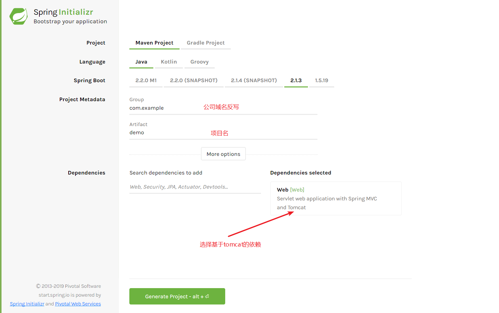
- 将下载的包解压并导入IDEA
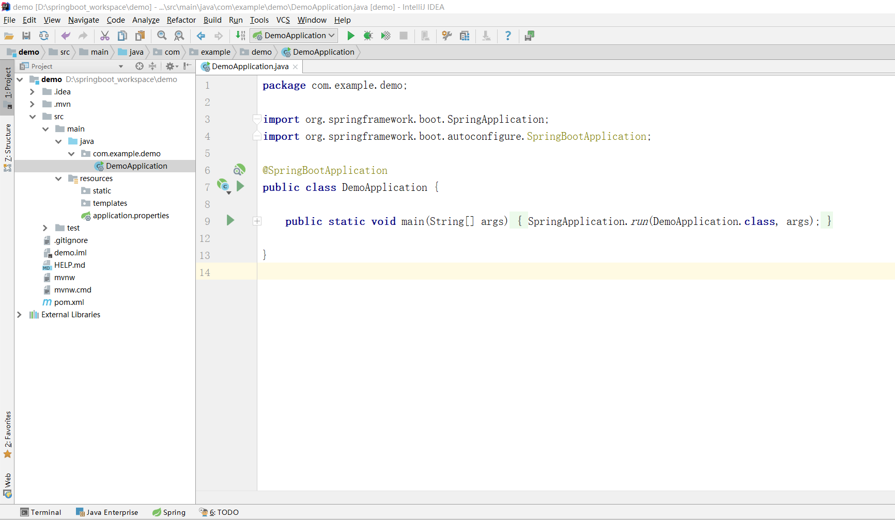
- 启动我们的项目,访问8080端口
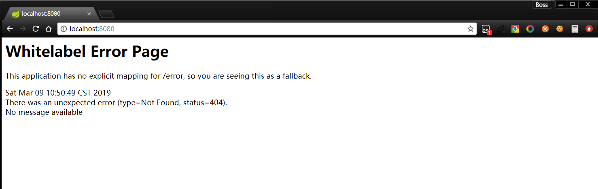
看到找不到页面选项就代表成功,因为我们还没有配置静态资源  
##第二章  节接口开发
###1.路由配置
- 首先要明白几个注解
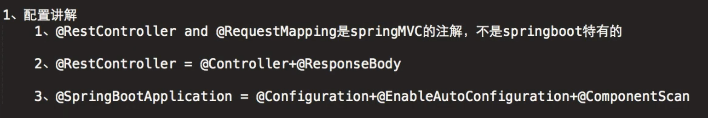
- 创建一个controller
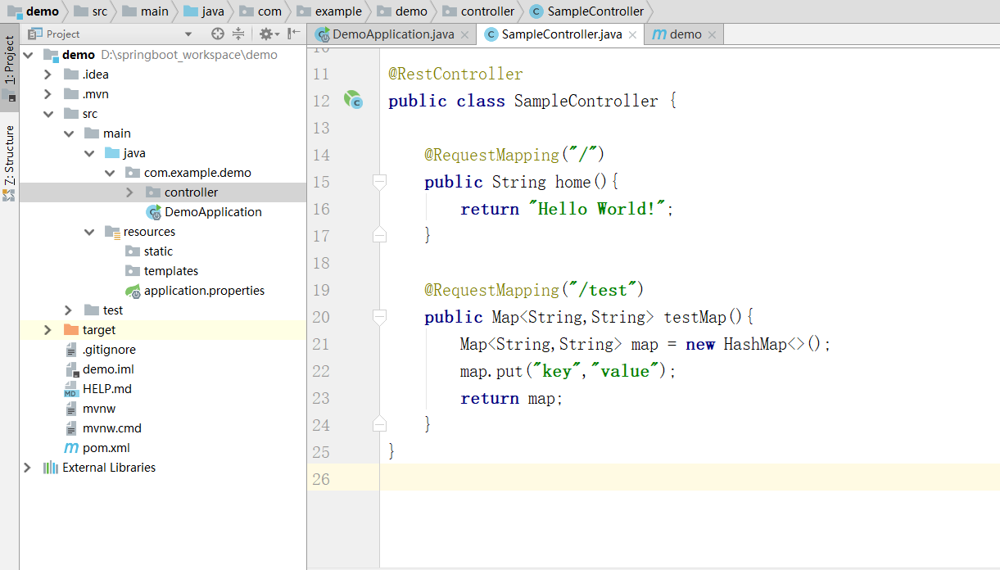
```java
@RequestMapping("/")
    public String home(){
        return "Hello World!";
    }

@RequestMapping("/test")
public Map<String,String> testMap(){
    Map<String,String> map = new HashMap<>();
    map.put("key","value");
    return map;
}
```
- 然后进行测试
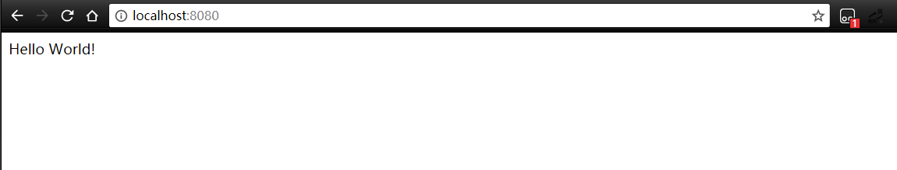
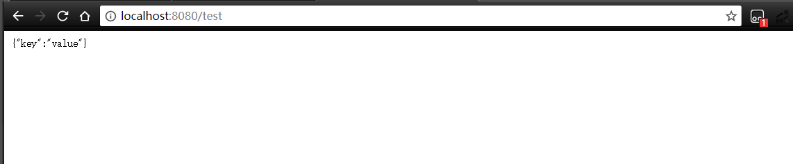

###2.postman接口测试  
```
postman下载地址https://www.getpostman.com/downloads/
```
- 在GetController中添加代码进行测试  
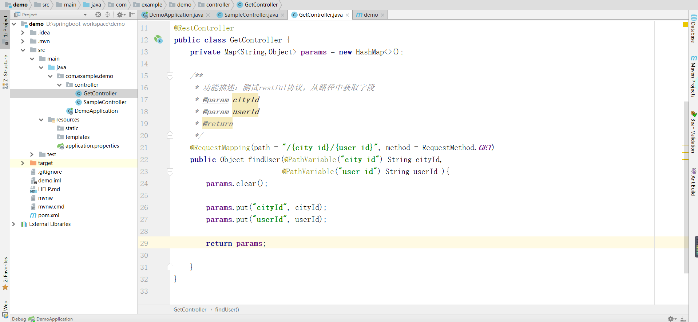

```java
private Map<String,Object> params = new HashMap<>();

    /**
     * 功能描述：测试restful协议，从路径中获取字段
     * @param cityId
     * @param userId
     * @return
     */
    @RequestMapping(path = "/{city_id}/{user_id}", method = RequestMethod.GET)
    public Object findUser(@PathVariable("city_id") String cityId,
                           @PathVariable("user_id") String userId ){
        params.clear();

        params.put("cityId", cityId);
        params.put("userId", userId);

        return params;

    }
```
然后我们用postman进行测试
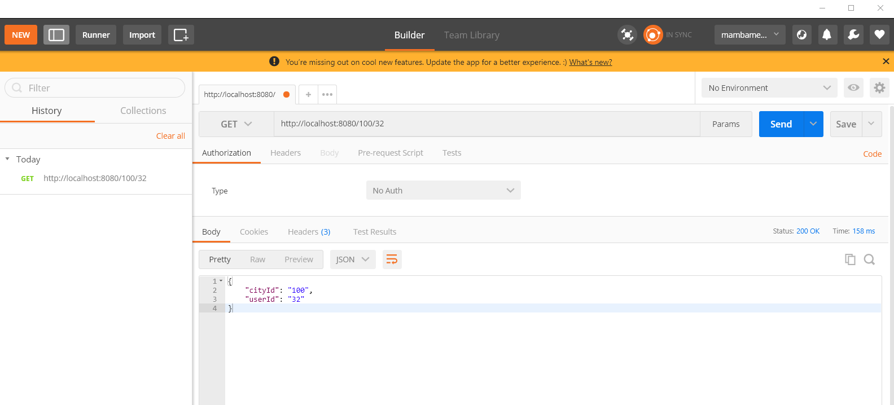

- GetMapping
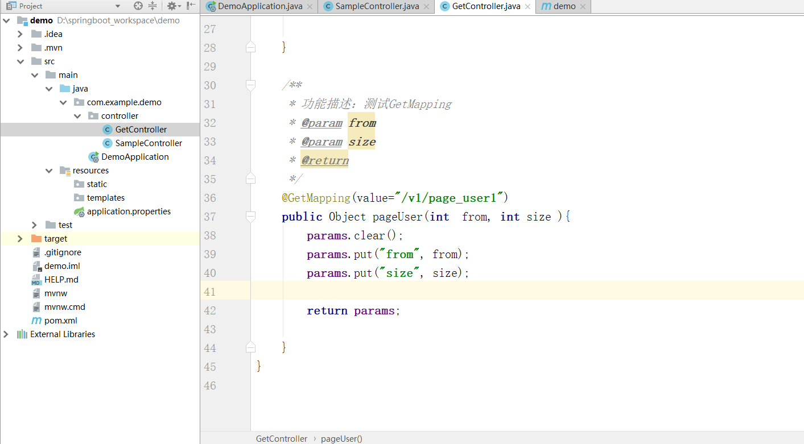
```java
 /**
     * 功能描述：测试GetMapping
     * @param from
     * @param size
     * @return
     */
    @GetMapping(value="/v1/page_user1")
    public Object pageUser(int  from, int size ){
        params.clear();
        params.put("from", from);
        params.put("size", size);

        return params;

    }
```
然后我们用postman进行测试
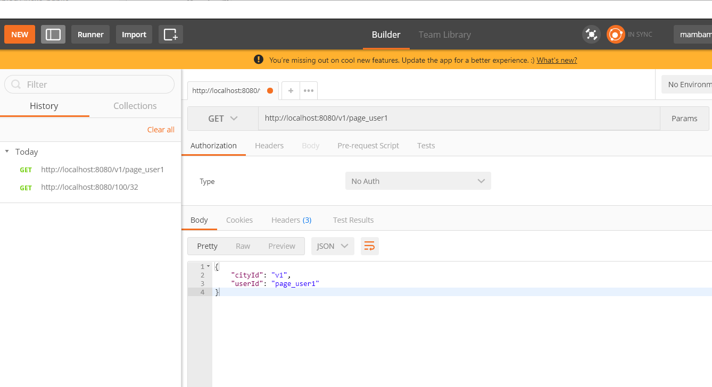

- GetMapping默认值
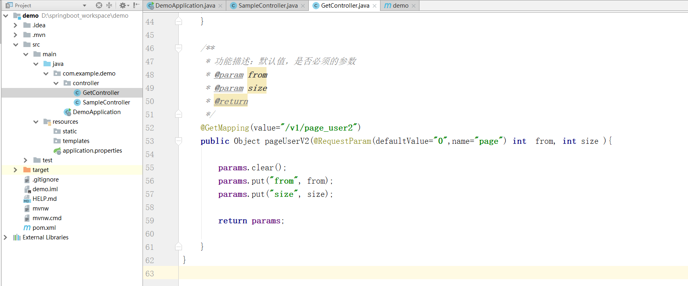
```java
/**
     * 功能描述：默认值，是否必须的参数
     * @param from
     * @param size
     * @return
     */
    @GetMapping(value="/v1/page_user2")
    public Object pageUserV2(@RequestParam(defaultValue="0",name="page") int  from, int size ){

        params.clear();
        params.put("from", from);
        params.put("size", size);

        return params;

    }
```
然后我们用postman进行测试
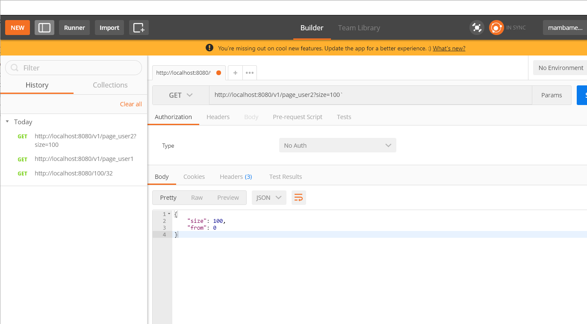
如果没有传入参数那么将会启用默认值

- bean对象传参
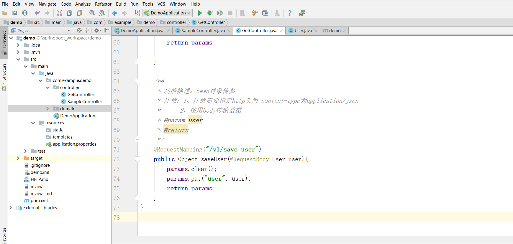
```java
 /**
     * 功能描述：bean对象传参
     * 注意：1、注意需要指定http头为 content-type为application/json
     * 		2、使用body传输数据
     * @param user
     * @return
     */
    @RequestMapping("/v1/save_user")
    public Object saveUser(@RequestBody User user){
        params.clear();
        params.put("user", user);
        return params;
    }
```
然后我们用postman进行测试
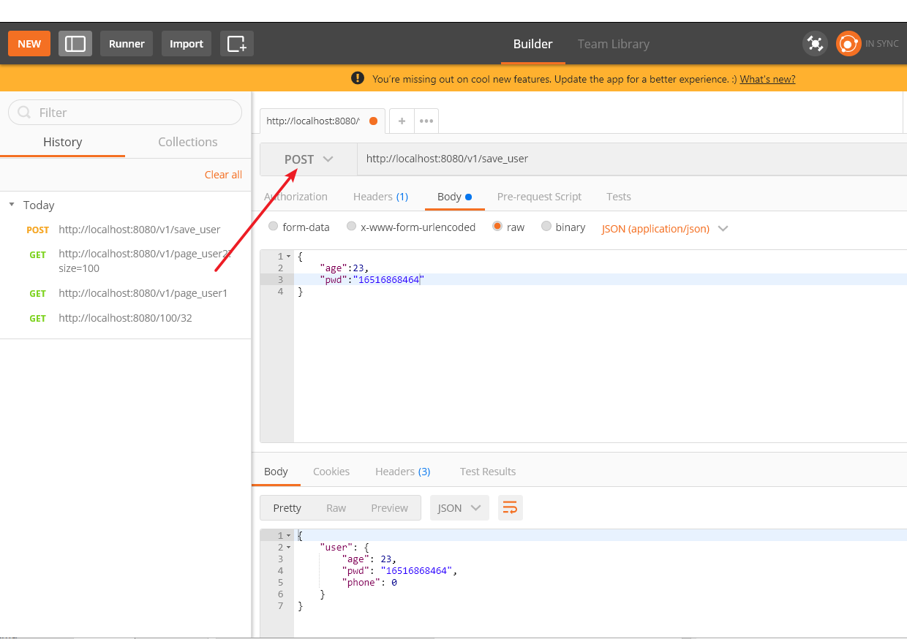

- 获取请求头信息
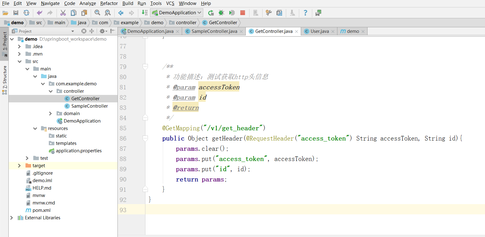
```java
/**
     * 功能描述：测试获取http头信息
     * @param accessToken
     * @param id
     * @return
     */
    @GetMapping("/v1/get_header")
    public Object getHeader(@RequestHeader("access_token") String accessToken, String id){
        params.clear();
        params.put("access_token", accessToken);
        params.put("id", id);
        return params;
    }
```
然后我们用postman进行测试
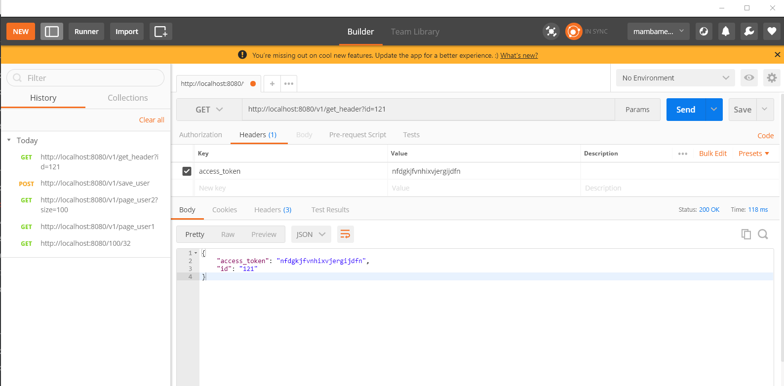