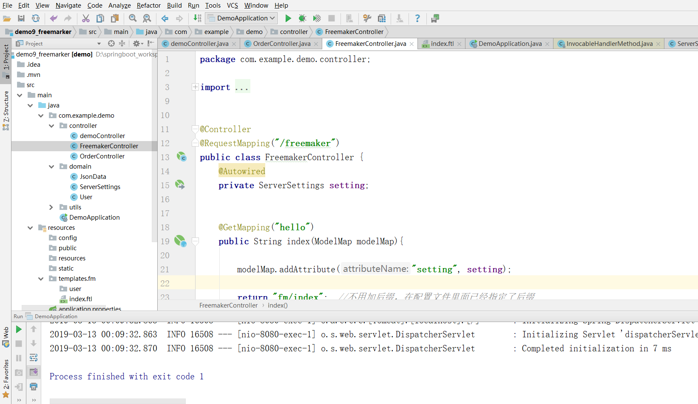

<p class="description"></p>

<meta name="referrer" content="no-referrer" />


<!-- more -->

# springboot官方文档:

```
https://docs.spring.io/spring-boot/docs/2.1.3.RELEASE/reference/htmlsingle/
```

# What is springboot?  

```
Spring Boot makes it easy to create stand-alone, 
production-grade Spring based Applications that you can "just run".

We take an opinionated view of the Spring platform and third-party libraries so you can get started with minimum fuss. 
Most Spring Boot applications need very little Spring configuration.

Spring Boot可以轻松创建独立的，
生产级基于Spring的应用程序，您可以“运行”。

我们对Spring平台和第三方库采取了自以为是的观点，因此您可以尽量少开始。
大多数Spring Boot应用程序只需要很少的Spring配置。
```

# Why use it?

```
Create stand-alone Spring applications

Embed Tomcat, Jetty or Undertow directly (no need to deploy WAR files)

Provide opinionated 'starter' dependencies to simplify your build configuration

Automatically configure Spring and 3rd party libraries whenever possible

Provide production-ready features such as metrics, health checks and externalized configuration

Absolutely no code generation and no requirement for XML configuration

创建独立的Spring应用程序

直接嵌入Tomcat，Jetty或Undertow（无需部署WAR文件）

提供自以为是的“入门”依赖项以简化构建配置

尽可能自动配置Spring和第三方库

提供生产就绪功能，例如指标，运行状况检查和外部化配置

绝对没有代码生成，也不需要XML配置
```

# How to use it?

## 第一章   快速入门

- 进入https://start.spring.io/

- 将下载的包解压并导入IDEA

- 启动我们的项目,访问8080端口

看到找不到页面选项就代表成功,因为我们还没有配置静态资源  

## 第二章   http协议开发

### 1.路由配置

- 首先要明白几个注解

- 创建一个controller

```java
@RequestMapping("/")
    public String home(){
        return "Hello World!";
    }

@RequestMapping("/test")
public Map<String,String> testMap(){
    Map<String,String> map = new HashMap<>();
    map.put("key","value");
    return map;
}
```
- 然后进行测试


### 2.postman接口测试  

```
postman下载地址https://www.getpostman.com/downloads/
```
- 在GetController中添加代码进行测试  


```java
private Map<String,Object> params = new HashMap<>();

    /**
     * 功能描述：测试restful协议，从路径中获取字段
     * @param cityId
     * @param userId
     * @return
     */
    @RequestMapping(path = "/{city_id}/{user_id}", method = RequestMethod.GET)
    public Object findUser(@PathVariable("city_id") String cityId,
                           @PathVariable("user_id") String userId ){
        params.clear();

        params.put("cityId", cityId);
        params.put("userId", userId);

        return params;

    }
```
然后我们用postman进行测试


- GetMapping

```java
 /**
     * 功能描述：测试GetMapping
     * @param from
     * @param size
     * @return
     */
    @GetMapping(value="/v1/page_user1")
    public Object pageUser(int  from, int size ){
        params.clear();
        params.put("from", from);
        params.put("size", size);

        return params;

    }
```
然后我们用postman进行测试


- GetMapping默认值

```java
/**
     * 功能描述：默认值，是否必须的参数
     * @param from
     * @param size
     * @return
     */
    @GetMapping(value="/v1/page_user2")
    public Object pageUserV2(@RequestParam(defaultValue="0",name="page") int  from, int size ){

        params.clear();
        params.put("from", from);
        params.put("size", size);

        return params;

    }
```
然后我们用postman进行测试

如果没有传入参数那么将会启用默认值

- bean对象传参
在domain包下创建一个实体类


```java
public class User {
    private int age;
    private String pwd;
    private int phone;

    public User() {

    }

    public User(int age, String pwd, int phone) {
        this.age = age;
        this.pwd = pwd;
        this.phone = phone;
    }

    public int getAge() {
        return age;
    }

    public void setAge(int age) {
        this.age = age;
    }

    public String getPwd() {
        return pwd;
    }

    public void setPwd(String pwd) {
        this.pwd = pwd;
    }

    public int getPhone() {
        return phone;
    }

    public void setPhone(int phone) {
        this.phone = phone;
    }

    @Override
    public String toString() {
        return "User{" +
                "age=" + age +
                ", pwd='" + pwd + '\'' +
                ", phone=" + phone +
                '}';
    }
}
```


```java
 /**
     * 功能描述：bean对象传参
     * 注意：1、注意需要指定http头为 content-type为application/json
     * 		2、使用body传输数据
     * @param user
     * @return
     */
    @RequestMapping("/v1/save_user")
    public Object saveUser(@RequestBody User user){
        params.clear();
        params.put("user", user);
        return params;
    }
```
然后我们用postman进行测试


- 获取请求头信息

```java
/**
     * 功能描述：测试获取http头信息
     * @param accessToken
     * @param id
     * @return
     */
    @GetMapping("/v1/get_header")
    public Object getHeader(@RequestHeader("access_token") String accessToken, String id){
        params.clear();
        params.put("access_token", accessToken);
        params.put("id", id);
        return params;
    }
```
然后我们用postman进行测试

- post提交方式


```java
private Map<String,Object> params = new HashMap<>();
    /**
     * 功能描述：测试PostMapping
     * @param id
     * @param pwd
     * @return
     */
    @PostMapping("/v1/login")
    public Object login(String id, String pwd){
        params.clear();
        params.put("id", id);
        params.put("pwd", pwd);
        return params;
    }
```

然后我们用postman进行测试


- put提交方式


```java
  @PutMapping("/v1/put")
    public Object put(String id){
        params.clear();
        params.put("id", id);
        return params;
    }
```
然后我们用postman进行测试


- delete提交方式


```java
   @DeleteMapping("/v1/del")
    public Object del(String id){
        params.clear();
        params.put("id", id);
        return params;
    }
```

然后我们用postman进行测试


### 3.常用json框架介绍和jackson返回结果处理
```
常用框架 阿里 fastjson,谷歌gson等  
JavaBean序列化为Json，性能：Jackson > FastJson > Gson > Json-lib 同个结构
Jackson、FastJson、Gson类库各有优点，各有自己的专长
空间换时间，时间换空间
```
为我们的User类添加一个新字段重新生成get/set方法


在SampleController中添加一个新接口
```java
 @GetMapping("/testjson")
    public Object testjson(){

        return new User(111, "abc123", "10001000", new Date());
    }
```
测试结果

但是密码不应该暴露给前端,我们在User类中添加一个注解

添加完之后启动应用再次测试

这样就保证了我们的数据安全

```
类似的注解还有:
指定字段不返回：@JsonIgnore
指定日期格式：@JsonFormat(pattern="yyyy-MM-dd hh:mm:ss",locale="zh",timezone="GMT+8")
空字段不返回：@JsonInclude(Include.NON_NUll)
指定别名：@JsonProperty
```

### 4.springboot目录结构讲解
```
src/main/java：存放代码
src/main/resources
    static: 存放静态文件，比如 css、js、image, （访问方式 http://localhost:8080/js/main.js）
    templates:存放静态页面jsp,html,tpl
    config:存放配置文件,application.properties
    resources:脚本文件

Spring Boot 默认会挨个从
resources > static外 > public 里面找是否存在相应的资源，如果有则直接返回。
src/main/resources目录下资源加载的顺序

```
我们先把restful风格的接口注释掉防止影响

然后按照图中示例进行测试


<font color=red>templates下的文件一般是静态模板没有加入classpath中,直接访问会找不到资源路径需要引入依赖</font>  

在pom文件中引入依赖
```
<dependency>
   <groupId>org.springframework.boot</groupId>
   <artifactId>spring-boot-starter-thymeleaf</artifactId>
</dependency>
```
新建一个FileController

加入代码
```java
 @RequestMapping(value = "/api/v1/gopage")
    public Object index() {

        return "index";
    }
```
在templates文件夹下加入html文件
```html
<!DOCTYPE html>
<html lang="en">
<head>
    <meta charset="UTF-8">
    <title>Title</title>
</head>
<body>
    hello  thymeleaf!!!
</body>
</html>
```
再次访问url


官方默认spring加载静态资源配置路径
```
spring.resources.static-locations = classpath:/META-INF/resources/,classpath:/resources/,classpath:/static/,classpath:/public/ 
```
如果想自定义spring加载静态资源配置路径在后面追加即可(加载的有限顺序调整顺序即可),示例如下:
```
spring.resources.static-locations = classpath:/META-INF/resources/,classpath:/resources/,classpath:/static/,classpath:/public/ ,classpath:/test/
```
### 5.springboot文件上传实战
在static加入上传文件的页面

```html
<!DOCTYPE html>
<html>
  <head>
    <title>uploadimg.html</title>

    <meta name="keywords" content="keyword1,keyword2,keyword3"></meta>
	<meta http-equiv="Content-Type" content="text/html; charset=utf-8" />

    <script src="/js/test.js" type="text/javascript"></script>

  </head>

  <body>
	  <form enctype="multipart/form-data" method="post" action="/upload">
	    文件:<input type="file" name="head_img"/>
	    姓名:<input type="text" name="name"/>
	    <input type="submit" value="上传"/>
	   </form>
   
  </body>
</html>
```
然后在FileController中添加后台代码
<font color=red>注意替换自己存放文件的路径</font>  


```java
//注意替换路径
 private static final String filePath = "D:\\springboot_workspace\\demo\\src\\main\\resources\\static\\image\\";

@RequestMapping(value = "upload")
    @ResponseBody
    public JsonData upload(@RequestParam("head_img") MultipartFile file, HttpServletRequest request) {

        //file.isEmpty(); 判断图片是否为空
        //file.getSize(); 图片大小进行判断

        String name = request.getParameter("name");
        System.out.println("用户名："+name);

        // 获取文件名
        String fileName = file.getOriginalFilename();
        System.out.println("上传的文件名为：" + fileName);

        // 获取文件的后缀名,比如图片的jpeg,png
        String suffixName = fileName.substring(fileName.lastIndexOf("."));
        System.out.println("上传的后缀名为：" + suffixName);

        // 文件上传后的路径
        fileName = UUID.randomUUID() + suffixName;
        System.out.println("转换后的名称:"+fileName);

        File dest = new File(filePath + fileName);

        try {
            //MultipartFile 对象的transferTo方法，用于文件保存（效率和操作比原先用FileOutStream方便和高效）
            file.transferTo(dest);

            return new JsonData(0, fileName);
        } catch (IllegalStateException e) {
            e.printStackTrace();
        } catch (IOException e) {
            e.printStackTrace();
        }
        return  new JsonData(-1, "fail to save ", null);
    }
```
响应的时候应该返回给前台一个包装的json类

```java
	private static final long serialVersionUID = 1L;

	//状态码,0表示成功，-1表示失败
	private int code;
	
	//结果
	private Object data;

	//错误描述
	private String msg;
	
	public int getCode() {
		return code;
	}

	public String getMsg() {
		return msg;
	}

	public void setMsg(String msg) {
		this.msg = msg;
	}

	public void setCode(int code) {
		this.code = code;
	}

	public Object getData() {
		return data;
	}

	public void setData(Object data) {
		this.data = data;
	}

	public JsonData(int code, Object data) {
		super();
		this.code = code;
		this.data = data;
	}

	public JsonData(int code, String msg,Object data) {
		super();
		this.code = code;
		this.msg = msg;
		this.data = data;
	}
```
向后台发送文件之后

这里会有一个问题当上传文件过大时,会抛出异常,那么我们应该如何去配置呢?

在含有Config注解的类下配置一个bean注解,解决文件上传问题
```java
@Bean
    public MultipartConfigElement multipartConfigElement() {
        MultipartConfigFactory factory = new MultipartConfigFactory();
        //单个文件最大
        factory.setMaxFileSize("10240KB"); //KB,MB
        /// 设置总上传数据总大小
        factory.setMaxRequestSize("1024000KB");
        return factory.createMultipartConfig();
    }
```
### 6.jar包方式启动项目并访问资源
检查自己的pom.xml是否有打包插件,如果没加相关依赖，执行maven打包，运行后会报错:no main manifest attribute, in XXX.jar
```
<build>
		<plugins>
			<plugin>
				<groupId>org.springframework.boot</groupId>
				<artifactId>spring-boot-maven-plugin</artifactId>
			</plugin>
		</plugins>
	</build>
```
使用 mvn install 将项目打包

将jar包后缀换成zip并解压查看目录


如果你上传的图片路径是自定义的,请自行在配置文件中添加
web.images-path=自定义路径
spring.resources.static-locations=classpath:/META-INF/resources/,classpath:/resources/,classpath:/static/,classpath:/public/,classpath:/test/,file:${web.upload-path} 
为了解决高并发你应该去使用:fastdfs，阿里云oss，nginx搭建一个简单的文件服务器

### 7.SpringBoot2.x使用Dev-tool热部署
1. 添加依赖
    <dependency>  
         <groupId>org.springframework.boot</groupId>  
         <artifactId>spring-boot-devtools</artifactId>  
         <optional>true</optional>  
      	</dependency>
2. 在IDEA设置中打开自动编译
 
3. 打开运行时编译,按快捷键 Shift+Ctrl+Alt+/ ，打开maintenance面板, 选择 Registry  
   勾选如图所示:

不被热部署的文件  
	 		1、/META-INF/maven, /META-INF/resources, /resources, /static, /public, or /templates  
	 		2、指定文件不进行热部署 spring.devtools.restart.exclude=static/**,public/**  
	 		3、手工触发重启 spring.devtools.restart.trigger-file=trigger.txt(trigger.txt放在最外层的resource下)
	 			改代码不重启，通过一个文本去控制

官方地址：https://docs.spring.io/spring-boot/docs/2.1.0.BUILD-SNAPSHOT/reference/htmlsingle/#using-boot-devtools

### 8.SpringBoot2.x配置文件
简介：SpringBoot2.x常见的配置文件 xml、yml、properties的区别和使用
```
xml、properties、json、yaml
1、常见的配置文件 xx.yml, xx.properties，
    1)YAML（Yet Another Markup Language）
        写 YAML 要比写 XML 快得多(无需关注标签或引号)
        使用空格 Space 缩进表示分层，不同层次之间的缩进可以使用不同的空格数目
        注意：key后面的冒号，后面一定要跟一个空格,树状结构
    application.properties示例
        server.port=8090  
        server.session-timeout=30  
        server.tomcat.max-threads=0  
        server.tomcat.uri-encoding=UTF-8 

    application.yml示例
        server:  
            port: 8090  
            session-timeout: 30  
            tomcat.max-threads: 0  
            tomcat.uri-encoding: UTF-8 


2、默认示例文件仅作为指导。 不要将整个内容复制并粘贴到您的应用程序中，只挑选您需要的属性。

3、参考：https://docs.spring.io/spring-boot/docs/2.1.0.BUILD-SNAPSHOT/reference/htmlsingle/#common-application-properties

如果需要修改，直接复制对应的配置文件，加到application.properties里面
```
### 9.SpringBoot注解配置文件自动映射到属性和实体类实战
1、配置文件加载  
	方式一:    
        1、Controller上面配置  
            @PropertySource({"classpath:resource.properties"})  
            resource.properties里面的内容为k,v  
            2、增加属性  
                @Value("${test.name}")  
                private String name;  
        方式二：  
            实体类配置文件  
            步骤：  
                1、添加 @Component 注解；  
                2、使用 @PropertySource 注解指定配置文件位置；  
                3、使用 @ConfigurationProperties 注解，设置相关属性；  
                4、必须 通过注入IOC对象Resource 进来 ， 才能在类中使用获取的配置文件值。  
                    @Autowired  
                    private ServerSettings serverSettings;  
                    例子：  
                        新建一个domain  
```java
@Component
@PropertySource({"classpath:application.properties"})
@ConfigurationProperties
public class ServerSettings {
//名称
@Value("${test.name}")
private String name;
@Value("${test.domain}")
private String domain;
public String getName() {
    return name;
}
public void setName(String name) {
    this.name = name;
}
public String getDomain() {
    return domain;
}
public void setDomain(String domain) {
    this.domain = domain;
}
@Override
public String toString() {
    return "ServerSettings{" +
            "name='" + name + '\'' +
            ", domain='" + domain + '\'' +
            '}';
}
}
```
使用前缀
@ConfigurationProperties（prefix = "xxx"）
如果使用前缀的话则不需要@Value注解
  
常见问题：  
    1、配置文件注入失败，Could not resolve placeholder  
        解决：根据springboot启动流程，会有自动扫描包没有扫描到相关注解,   
        默认Spring框架实现会从声明@ComponentScan所在的类的package进行扫描，来自动注入，  
        因此启动类最好放在根路径下面，或者指定扫描包范围  
        spring-boot扫描启动类对应的目录和子目录  
    2、注入bean的方式，属性名称和配置文件里面的key一一对应，就用加@Value 这个注解  
        如果不一样，就要加@value("${XXX}")  

### 10.SpringBoot单元测试  
1. 引入相关依赖
```
  <!--springboot程序测试依赖，如果是自动创建项目默认添加-->
    <dependency>
        <groupId>org.springframework.boot</groupId>
        <artifactId>spring-boot-starter-test</artifactId>
        <scope>test</scope>
    </dependency>
```
2. 使用@RunWith(SpringRunner.class)  //底层用junit  SpringJUnit4ClassRunner 
       @SpringBootTest(classes={DemoApplication.class})//启动整个springboot工程  
  

SpringBoot测试进阶高级篇之MockMvc讲解   
简介:讲解MockMvc类的使用和模拟Http请求实战   
1、增加类注解 @AutoConfigureMockMvc   
        @SpringBootTest(classes={XdclassApplication.class})    
2、相关API   
perform：执行一个RequestBuilder请求  
andExpect：添加ResultMatcher->MockMvcResultMatchers验证规则  
andReturn：最后返回相应的MvcResult->Response  


### 11.SpringBoot2.x个性化启动banner设置和debug日志  
简介：自定义应用启动的趣味性日志图标和查看调试日志  
1、启动获取更多信息 java -jar xxx.jar --debug  
2、修改启动的banner信息  
1）在类路径下增加一个banner.txt，里面是启动要输出的信息  
2）在applicatoin.properties增加banner文件的路径地址   
    spring.banner.location=banner.txt  
3）官网地址 https://docs.spring.io/spring-boot/docs/2.1.0.BUILD-SNAPSHOT/reference/htmlsingle/#boot-features-banners  


### 12.SpringBoot2.x配置全局异常实战  
讲解：服务端异常讲解和SpringBoot配置全局异常实战  
1、默认异常测试  int i = 1/0，不友好,如果是前后端分离前端你抛一个404的页面前端不知道该如何去处理  
先定义一个异常

```java
@RestController  
public class ExcptionController {  
    @RequestMapping(value = "/api/v1/test_ext")  
    public Object index() {  
        int i= 1/0;  
        return new User(11, "sfsfds", "1000000", new Date());  
    }  
}  
```

2、异常注解介绍  
@ControllerAdvice 如果是返回json数据 则用 RestControllerAdvice,就可以不加 @ResponseBody  
//捕获全局异常,处理所有不可知的异常  
@ExceptionHandler(value=Exception.class)  

```java
@RestControllerAdvice
public class CustomExtHandler {
    private static final Logger LOG = LoggerFactory.getLogger(CustomExtHandler.class);

	//捕获全局异常,处理所有不可知的异常
	@ExceptionHandler(value=Exception.class)
	//@ResponseBody
    Object handleException(Exception e,HttpServletRequest request){
		LOG.error("url {}, msg {}",request.getRequestURL(), e.getMessage()); 
		Map<String, Object> map = new HashMap<>();
	        map.put("code", 100);
	        map.put("msg", e.getMessage());
	        map.put("url", request.getRequestURL());
	        return map;
    }
}
```
这样就能返回一个json数据给前端了

### 13.SpringBoot2.x配置自定义异常实战  
简介：使用SpringBoot自定义异常和错误页面跳转实战  
1、返回自定义异常界面，需要引入thymeleaf依赖  
```
<dependency>  
   <groupId>org.springframework.boot</groupId>  
   <artifactId>spring-boot-starter-thymeleaf</artifactId>  
</dependency>

```
2、创建自定义异常类

```java
public class MyException extends RuntimeException {

    public MyException(String code, String msg) {
        this.code = code;
        this.msg = msg;
    }

    private String code;
    private String msg;
	public String getCode() {
		return code;
	}
	public void setCode(String code) {
		this.code = code;
	}
	public String getMsg() {
		return msg;
	}
	public void setMsg(String msg) {
		this.msg = msg;
	}

}
```
3、写一个异常路由

```java
/**
	 * 功能描述：模拟自定义异常
	 * @return
	 */
	@RequestMapping("/api/v1/myext")
	public Object myexc(){

		throw new MyException("499", "my ext异常");

	}
```

4、处理自定义异常

```java
	/**
	 * 功能描述：处理自定义异常
	 * @return
	 */
	@ExceptionHandler(value=MyException.class)
	Object handleMyException(MyException e,HttpServletRequest request){
		//进行页面跳转
//		ModelAndView modelAndView = new ModelAndView();
//	    modelAndView.setViewName("error.html");
//	    modelAndView.addObject("msg", e.getMessage());
//	    return modelAndView;

		//返回json数据，由前端去判断加载什么页面
		Map<String, Object> map = new HashMap<>();
		map.put("code", e.getCode());
		map.put("msg", e.getMsg());
		map.put("url", request.getRequestURL());
		return map;

	}
```
https://docs.spring.io/spring-boot/docs/2.1.0.BUILD-SNAPSHOT/reference/htmlsingle/#boot-features-error-handling


### 14.SpringBoot启动方式讲解和部署war项目到tomcat
1、ide启动
	2、jar包方式启动
				maven插件:
				<build>
				<plugins>
					<plugin>
						<groupId>org.springframework.boot</groupId>
						<artifactId>spring-boot-maven-plugin</artifactId>
					</plugin>
				</plugins>
				</build>
				如果没有加，则执行jar包 ，报错如下
					java -jar spring-boot-demo-0.0.1-SNAPSHOT.jar
					no main manifest attribute, in spring-boot-demo-0.0.1-SNAPSHOT.jar
				如果有安装maven 用 mvn spring-boot:run
		项目结构
			example.jar
					 |
					 +-META-INF
					 |  +-MANIFEST.MF
					 +-org
					 |  +-springframework
					 |     +-boot
					 |        +-loader
					 |           +-<spring boot loader classes>
					 +-BOOT-INF
					    +-classes
					    |  +-mycompany
					    |     +-project
					    |        +-YourClasses.class
					    +-lib
					       +-dependency1.jar
					       +-dependency2.jar
	目录结构讲解
	https://docs.spring.io/spring-boot/docs/2.1.0.BUILD-SNAPSHOT/reference/htmlsingle/#executable-jar-jar-file-structure

3、war包方式启动
1)在pom.xml中<version>下方将打包形式jar修改为war        
  ```
  <packaging>war</packaging>
  ```
构建项目名称
```
<finalName>demo_springboot</finalName>
```
如下
```
<?xml version="1.0" encoding="UTF-8"?>
<project xmlns="http://maven.apache.org/POM/4.0.0" xmlns:xsi="http://www.w3.org/2001/XMLSchema-instance"
		 xsi:schemaLocation="http://maven.apache.org/POM/4.0.0 http://maven.apache.org/xsd/maven-4.0.0.xsd">
	<modelVersion>4.0.0</modelVersion>
	<parent>
		<groupId>org.springframework.boot</groupId>
		<artifactId>spring-boot-starter-parent</artifactId>
		<version>2.1.3.RELEASE</version>
		<relativePath/> <!-- lookup parent from repository -->
	</parent>
	<groupId>com.example</groupId>
	<artifactId>demo</artifactId>
	<packaging>war</packaging>
	<version>0.0.1-SNAPSHOT</version>
	<name>demo</name>
	<description>Demo project for Spring Boot</description>

	<properties>
		<java.version>1.8</java.version>
	</properties>

	<!--web启动器-->
	<dependencies>
		<dependency>
			<groupId>org.springframework.boot</groupId>
			<artifactId>spring-boot-starter-web</artifactId>
		</dependency>

		<dependency>
			<groupId>org.springframework.boot</groupId>
			<artifactId>spring-boot-starter-test</artifactId>
			<scope>test</scope>
		</dependency>
	</dependencies>

	<!--打包插件-->
	<build>
		<finalName>demo_springboot</finalName>
		<plugins>
			<plugin>
				<groupId>org.springframework.boot</groupId>
				<artifactId>spring-boot-maven-plugin</artifactId>
			</plugin>
		</plugins>
	</build>

</project>

```


2)tocmat下载 https://tomcat.apache.org/download-90.cgi

3)修改启动类
```java
@SpringBootApplication
public class DemoApplication extends SpringBootServletInitializer {

 @Override
    protected SpringApplicationBuilder configure(SpringApplicationBuilder application) {
        return application.sources(DemoApplication.class);
    }

    public static void main(String[] args) throws Exception {
        SpringApplication.run(DemoApplication.class, args);
    }
}
```
4)执行meaven命令mvn install打包项目  
5)将打好的包放在tomcat容器webapp目录下中,tomcat会自动解压这个war包


### 15.SpringBoot2.x过滤器Filter
filter简单理解：人--->检票员（filter）---> 景点

1、SpringBoot启动默认加载的Filter 
characterEncodingFilter
hiddenHttpMethodFilter
httpPutFormContentFilter
requestContextFilter
    
2、Filter优先级

Ordered.HIGHEST_PRECEDENCE
Ordered.LOWEST_PRECEDENCE

低位值意味着更高的优先级 Higher values are interpreted as lower priority
自定义Filter，避免和默认的Filter优先级一样，不然会冲突

注册Filter的bean FilterRegistrationBean
同模块里面有相关默认Filter
    web->servlet->filter


3、自定义Filter
1）使用Servlet3.0的注解进行配置
2）启动类里面增加 @ServletComponentScan，进行扫描
3）新建一个Filter类，implements Filter，并实现对应的接口
4) @WebFilter 标记一个类为filter，被spring进行扫描 
    urlPatterns：拦截规则，支持正则

6）控制chain.doFilter的方法的调用，来实现是否通过放行
   不放行，web应用resp.sendRedirect("/index.html");
    场景：权限控制、用户登录(非前端后端分离场景)等

```java
@WebFilter(urlPatterns = "/api/*", filterName = "loginFilter")
public class LoginFilter  implements Filter{

	 /**
	  * 容器加载的时候调用
	  */
	  @Override
      public void init(FilterConfig filterConfig) throws ServletException {
          System.out.println("init loginFilter");
      }

	  /**
	   * 请求被拦截的时候进行调用
	   */
      @Override
      public void doFilter(ServletRequest servletRequest, ServletResponse servletResponse, FilterChain filterChain) throws IOException, ServletException {
    	  System.out.println("doFilter loginFilter");
    	  
    	  HttpServletRequest req = (HttpServletRequest) servletRequest;
          HttpServletResponse resp = (HttpServletResponse) servletResponse;
          String username = req.getParameter("username");
          
          if ("demo".equals(username)) {
              //放行之后继续回到我们的controller层
        	  filterChain.doFilter(servletRequest,servletResponse);
          } else {
        	  resp.sendRedirect("/index.html");
        	  return;
          }
      }
      
      /**
       * 容器被销毁的时候被调用
       */
      @Override
      public void destroy() {
    	  System.out.println("destroy loginFilter");
      }
}
```
放行

不放行


1、官网地址：https://docs.spring.io/spring-boot/docs/2.1.0.BUILD-SNAPSHOT/reference/htmlsingle/#boot-features-embedded-container-servlets-filters-listeners


### 16.Servlet3.0的注解自定义原生Servlet实战
在启动类添加注解@ServletComponentScan
自定义原生Servlet
```java
@WebServlet(name = "userServlet",urlPatterns = "/test/customs")
			public class UserServlet extends HttpServlet{

				 @Override
			     public void doGet(HttpServletRequest req, HttpServletResponse resp) throws ServletException, IOException {
			         resp.getWriter().print("custom sevlet");
			         resp.getWriter().flush();
			         resp.getWriter().close();
			     }

			     @Override
			     protected void doPost(HttpServletRequest req, HttpServletResponse resp) throws ServletException, IOException {
			         this.doGet(req, resp);
			     }
			}
```

### 17.Servlet3.0的注解原生Linstener监听器实战
在启动类添加注解@ServletComponentScan
自定义Listener(常用的监听器 servletContextListener、httpSessionListener、servletRequestListener)
```java
@WebListener
public class RequestListener implements ServletRequestListener {

@Override
public void requestDestroyed(ServletRequestEvent sre) {
    // TODO Auto-generated method stub
    //请求之后执行的代码
    System.out.println("======requestDestroyed========");
}

@Override
public void requestInitialized(ServletRequestEvent sre) {
    //请求之前执行的代码
    System.out.println("======requestInitialized========");
}
```

```java
@WebListener
public class CustomContextListener implements ServletContextListener{

	@Override
	public void contextInitialized(ServletContextEvent sce) {
	    //容器启动时执行的代码,一般做资源的加载,缓存预热,一般会单独开一个线程去处理
		System.out.println("======contextInitialized========");
		
	}

	@Override
	public void contextDestroyed(ServletContextEvent sce) {
		System.out.println("======contextDestroyed========");
		
	}
}
```

### 18.SpringBoot2.X自定义拦截器实战及新旧配置对比
简介: 讲解拦截器使用，Spingboot2.x新版本配置拦截拦截器和旧版本SpringBoot配置拦截器区别讲解

1、启动类配置@ServletComponentScan

2、
自定义类继承SpringBoot2.X新版本配置拦截器 implements WebMvcConfigurer.记得加注解@Configuration


自定义类继承WebMvcConfigurationAdapter(SpringBoot2.X之前旧版本).记得加注解@Configuration


2、自定义拦截器 HandlerInterceptor

preHandle：调用Controller某个方法之前
postHandle：Controller之后调用，视图渲染之前，如果控制器Controller出现了异常，则不会执行此方法
afterCompletion：不管有没有异常，这个afterCompletion都会被调用，用于资源清理

3、按照注册顺序进行拦截，先注册，先被拦截

拦截器不生效常见问题：
1）是否有加@Configuration
2）拦截路径是否有问题 **  和 * 
3）拦截器最后路径一定要 “/**”， 如果是目录的话则是 /*/


过滤器和拦截器的区别:
    Filter
    是基于函数回调 doFilter()，而Interceptor则是基于AOP思想
    Filter在只在Servlet前后起作用，而Interceptor够深入到方法前后、异常抛出前后等
    依赖于Servlet容器即web应用中，而Interceptor不依赖于Servlet容器所以可以运行在多种环境。
    在接口调用的生命周期里，Interceptor可以被多次调用，而Filter只能在容器初始化时调用一次。
    Filter和Interceptor的执行顺序
    过滤前->拦截前->action执行->拦截后->过滤后


### 19.SpringBoot常用Starter介绍
简介：介绍什么是SpringBoot Starter和主要作用

1、官网地址：https://docs.spring.io/spring-boot/docs/2.1.0.BUILD-SNAPSHOT/reference/htmlsingle/#using-boot-starter

2、starter主要简化依赖用的
    spring-boot-starter-web	->里面包含多种依赖

3、几个常用的starter
    spring-boot-starter-activemq
    spring-boot-starter-aop
    spring-boot-starter-data-redis
    spring-boot-starter-freemarker
    spring-boot-starter-thymeleaf
    spring-boot-starter-webflux

### 21.SpringBoot2.x常见模板引擎讲解和官方推荐使用
简介：介绍常用的SpringBoot2.x模板引擎和官方推荐案例

1、JSP（后端渲染，消耗性能）
    Java Server Pages 动态网页技术,由应用服务器中的JSP引擎来编译和执行，再将生成的整个页面返回给客户端
    可以写java代码
    持表达式语言（el、jstl）
    内建函数
    JSP->Servlet(占用JVM内存)permSize
    javaweb官方推荐
    springboot不推荐 https://docs.spring.io/spring-boot/docs/2.1.0.BUILD-SNAPSHOT/reference/htmlsingle/#boot-features-jsp-limitations

2、Freemarker 
    FreeMarker Template Language（FTL）  文件一般保存为 xxx.ftl
    严格依赖MVC模式，不依赖Servlet容器（不占用JVM内存）
    内建函数

3、Thymeleaf (主推)
    轻量级的模板引擎（负责逻辑业务的不推荐，解析DOM或者XML会占用多的内存）
    可以直接在浏览器中打开且正确显示模板页面

直接是html结尾，直接编辑
demo.net/user/userinfo.html
社会工程学
伪装 防黑客

### 22.SpringBoot2.x整合模板引擎freemarker实战
1、Freemarker相关maven依赖
```
<!-- 引入freemarker模板引擎的依赖 -->
<dependency>
    <groupId>org.springframework.boot</groupId>
    <artifactId>spring-boot-starter-freemarker</artifactId>
</dependency>
```
2、在application.properties中进行Freemarker的基础配置
```
#是否开启freemarker缓存,本地为false，生产建议为true
spring.freemarker.cache=false

spring.freemarker.charset=UTF-8
spring.freemarker.allow-request-override=false
spring.freemarker.check-template-location=true

#类型
spring.freemarker.content-type=text/html

spring.freemarker.expose-request-attributes=true
spring.freemarker.expose-session-attributes=true

#文件后缀
spring.freemarker.suffix=.ftl
#路径
spring.freemarker.template-loader-path=classpath:/templates/
```
3、建立文件夹
    1)src/main/resources/templates/fm/user/
    2)建立一个index.ftl
    3)user文件夹下面建立一个user.html
```html
<!DOCTYPE html>
<html>
<head>
<meta charset="UTF-8">
<title>Insert title here</title>
</head>
<body>
<h1>这freemaker整合，index.html页面</h1>

<h1> ${setting.name} </h1>
<h1> ${setting.domain} </h1>

</body>
</html>
```
4、新建一个freemarkerController

```java
@Controller
@RequestMapping("/freemaker")
public class FreemakerController {
	@Autowired
	private ServerSettings setting;

	
	@GetMapping("hello")
	public String index(ModelMap modelMap){
		
		modelMap.addAttribute("setting", setting);
		
		return "fm/index";  //不用加后缀，在配置文件里面已经指定了后缀
	}
}
```
5、将ServerSettings这个模型类添加进来以供测试

```java
@Component
@PropertySource({"classpath:application.properties"})
@ConfigurationProperties(prefix="test")
public class ServerSettings {

	//名称
	
	//@Value("${appname}")
	private String name;
	
	//@Value("${domain}")
	private String domain;

	public String getName() {
		return name;
	}

	public void setName(String name) {
		this.name = name;
	}

	public String getDomain() {
		return domain;
	}

	public void setDomain(String domain) {
		this.domain = domain;
	}
}
```
5、application.properties文件中添加
```
test.domain=www.demo.net
test.name=springboot
```

### 23.SpringBoot2.x整合模板引擎thymeleaf实战

官网地址：https://www.thymeleaf.org/doc/articles/thymeleaf3migration.html
1、配置thymeleaf相关maven依赖
```
<dependency>
    <groupId>org.springframework.boot</groupId>
    <artifactId>spring-boot-starter-thymeleaf</artifactId>
</dependency>
```

2、thymeleaf基础配置
```
#整合thymeleaf相关配置
#开发时关闭缓存,不然没法看到实时页面
spring.thymeleaf.cache=false
spring.thymeleaf.mode=HTML5
#前缀
spring.thymeleaf.prefix=classpath:/templates/tl/
#编码
spring.thymeleaf.encoding=UTF-8
#类型
spring.thymeleaf.content-type=text/html
#名称的后缀
spring.thymeleaf.suffix=.html
```
3、建立Controller

```java
@Controller
@RequestMapping("/tyhmeleaf")
public class ThymeleafController {
	@Autowired
	private ServerSettings setting;

	@GetMapping("hello")
	public String index(){
		return "index";  //不用加后缀，在配置文件里面已经指定了后缀
	}

	@GetMapping("info")
	public String admin(ModelMap modelMap){
		
		modelMap.addAttribute("setting", setting);
		
		return "admin/info";  //不用加后缀，在配置文件里面已经指定了后缀
	}
}
```

4、建立文件夹
1)src/main/resources/templates/tl/
2)在template下admin模块下建一个info.html

```html
<!DOCTYPE html>
<html xmlns:th="http://www.w3.org/1999/xhtml">
<head>
<meta charset="UTF-8">
<title>Insert title here</title>
</head>
<body>
模板引擎整合thymeleaf  admin/info.html

<h1 >测试内容，未加th表达式</h1>
<h1 th:text="${setting.name}">测试内容</h1>
<h1>demo.net</h1>
</body>
</html>
```

4、简单测试代码编写和访问
    注意：$表达式只能写在th标签内部
    快速入门：https://www.thymeleaf.org/doc/articles/standarddialect5minutes.html
<hr />


### 23.SpringBoot2.x数据库操作之整合Mybaties
介绍近几年常用的访问数据库的方式和优缺点

1、原始java访问数据库
开发流程麻烦
```
1、注册驱动/加载驱动
    Class.forName("com.mysql.jdbc.Driver")
2、建立连接
    Connection con = DriverManager.getConnection("jdbc:mysql://localhost:3306/dbname","root","root");
3、创建Statement

4、执行SQL语句

5、处理结果集

6、关闭连接，释放资源

```

2、apache dbutils框架
```
比上一步简单点
    官网:https://commons.apache.org/proper/commons-dbutils/
```

3、jpa框架
```
spring-data-jpa
jpa在复杂查询的时候性能不是很好
```

4、Hiberante   
```
解释：ORM：对象关系映射Object Relational Mapping
企业大都喜欢使用hibernate
```

5、Mybatis框架  
```
互联网行业通常使用mybatis
不提供对象和关系模型的直接映射,半ORM
```

### 24.SpringBoot2.x整合Mybatis3.x注解配置实战

1、使用starter, maven仓库地址：http://mvnrepository.com/artifact/org.mybatis.spring.boot/mybatis-spring-boot-starter

2、加入依赖(可以用 http://start.spring.io/ 下载)
```
<!-- MySQL的JDBC驱动包	-->	
<!-- 引入starter-->
<dependency>
    <groupId>org.mybatis.spring.boot</groupId>
    <artifactId>mybatis-spring-boot-starter</artifactId>
    <version>1.3.2</version>
</dependency>

<!-- MySQL的JDBC驱动包	-->
<dependency>
    <groupId>mysql</groupId>
    <artifactId>mysql-connector-java</artifactId>
    <scope>runtime</scope>
</dependency>
<!-- 引入第三方数据源 -->
<dependency>
    <groupId>com.alibaba</groupId>
    <artifactId>druid</artifactId>
    <version>1.1.6</version>
</dependency>
```

3、加入配置文件
```
#mybatis.type-aliases-package=net.xdclass.base_project.domain
#可以自动识别
#spring.datasource.driver-class-name =com.mysql.jdbc.Driver

spring.datasource.url=jdbc:mysql://localhost:3306/mybaties_demo?useUnicode=true&characterEncoding=utf-8&serverTimezone=GMT%2B8
spring.datasource.username =root
spring.datasource.password =root
#如果不使用默认的数据源 （com.zaxxer.hikari.HikariDataSource,性能最快但不如Druid的监控）
spring.datasource.type =com.alibaba.druid.pool.DruidDataSource
```
加载配置，注入到sqlSessionFactory等都是springBoot帮我们完成

4、启动类增加mapper扫描
```
@MapperScan("com.example.demo.mapper")
```


 技巧：保存对象，获取数据库自增id 
 ```
  @Options(useGeneratedKeys=true, keyProperty="id", keyColumn="id")
 ```

4、开发controller services mapper  
开发controller:  
```java
@RestController
@RequestMapping("/api/v1/user")
public class UserController {
	
	
	@Autowired
	private UserService userService;
	
	
	/**
	 * 功能描述: user 保存接口
	 * @return
	 */
	@GetMapping("add")
	public Object add(){
		
		User user = new User();
		user.setAge(11);
		user.setCreateTime(new Date());
		user.setName("demo");
		user.setPhone("1000000000");
		int id = userService.add(user);
		
       return JsonData.buildSuccess(id);
	}
```
services:  
```java
public interface UserService {

	public int add(User user);
	//public int addAccount();
}
```
mapper:
```java
public interface UserMapper {
	
	//推荐使用#{}取值，不要用${},因为存在注入的风险
	 @Insert("INSERT INTO user(name,phone,create_time,age) VALUES(#{name}, #{phone}, #{createTime},#{age})")
	 @Options(useGeneratedKeys=true, keyProperty="id", keyColumn="id")   //keyProperty java对象的属性；keyColumn表示数据库的字段
	 int insert(User user);
	
//
//    @Select("SELECT * FROM user")
//    @Results({
            //create_time表示数据库的字段 property表示实体类的字段
            //从数据库查出来数据以后将数据库数据映射到实体类上
//        @Result(column = "create_time",property = "createTime")  //javaType = java.util.Date.class        
//    })
//    List<User> getAll();
//  
//    
//
//    @Select("SELECT * FROM user WHERE id = #{id}")
//    @Results({
//    	 @Result(column = "create_time",property = "createTime")
//    })
//    User findById(Long id);
//
//   
//
//    @Update("UPDATE user SET name=#{name} WHERE id =#{id}")
//    void update(User user);
//
//    @Delete("DELETE FROM user WHERE id =#{userId}")
//    void delete(Long userId);
//
}
```

参考语法 http://www.mybatis.org/mybatis-3/zh/java-api.html


5、sql脚本
```sql
CREATE TABLE `user` (
  `id` int(11) unsigned NOT NULL AUTO_INCREMENT,
  `name` varchar(128) DEFAULT NULL COMMENT '名称',
  `phone` varchar(16) DEFAULT NULL COMMENT '用户手机号',
  `create_time` datetime DEFAULT NULL COMMENT '创建时间',
  `age` int(4) DEFAULT NULL COMMENT '年龄',
  PRIMARY KEY (`id`)
) ENGINE=InnoDB AUTO_INCREMENT=18 DEFAULT CHARSET=utf8;
```


相关资料：
http://www.mybatis.org/spring-boot-starter/mybatis-spring-boot-autoconfigure/#Configuration

https://github.com/mybatis/spring-boot-starter/tree/master/mybatis-spring-boot-samples

整合问题集合：
https://my.oschina.net/hxflar1314520/blog/1800035
https://blog.csdn.net/tingxuetage/article/details/80179772


### 25.SpringBoot2.x整合Mybatis3.x增删改查实操和控制台打印SQL语句
```
#增加打印sql语句，一般用于本地开发测试
mybatis.configuration.log-impl=org.apache.ibatis.logging.stdout.StdOutImpl
```
增加mapper代码	

```java
@Select("SELECT * FROM user")
@Results({
    @Result(column = "create_time",property = "createTime")  //javaType = java.util.Date.class        
})
List<User> getAll();

@Select("SELECT * FROM user WHERE id = #{id}")
@Results({
     @Result(column = "create_time",property = "createTime")
})
User findById(Long id);

@Update("UPDATE user SET name=#{name} WHERE id =#{id}")
void update(User user);

@Delete("DELETE FROM user WHERE id =#{userId}")
void delete(Long userId);
```

增加Controller
```java
@GetMapping("find_all")
public Object findAll(){
   return JsonData.buildSuccess(userMapper.getAll());
}

@GetMapping("find_by_Id")
public Object findById(long id){
   return JsonData.buildSuccess(userMapper.findById(id));
}

@GetMapping("del_by_id")
public Object delById(long id){
userMapper.delete(id);
   return JsonData.buildSuccess();
}

@GetMapping("update")
public Object update(String name,int id){
    User user = new User();
    user.setName(name);
    user.setId(id);
    userMapper.update(user);
    return JsonData.buildSuccess();
}
```

### 26.事务介绍和常见的隔离级别，传播行为
不需要的时候不要加事务比较好费性能 它有个锁
1、service逻辑引入事务 
```
@Transantional(propagation=Propagation.REQUIRED)
```

2、service代码

```java
@Override
public int addAccount() {
User user = new User();
user.setAge(9);
user.setCreateTime(new Date());
user.setName("事务测试");
user.setPhone("000121212");

userMapper.insert(user);
int a = 1/0;

return user.getId();
}
```
此时尽管抛异常了但数据还是执行成功了

3、讲解场景的隔离级别  
Serializable： 最严格，串行处理，消耗资源大  
Repeatable Read：保证了一个事务不会修改已经由另一个事务读取但未提交（回滚）的数据  
Read Committed：大多数主流数据库的默认事务等级  
Read Uncommitted：保证了读取过程中不会读取到非法数据。  

4、讲解常见的传播行为
PROPAGATION_REQUIRED--支持当前事务，如果当前没有事务，就新建一个事务,最常见的选择。  

PROPAGATION_SUPPORTS--支持当前事务，如果当前没有事务，就以非事务方式执行。  

PROPAGATION_MANDATORY--支持当前事务，如果当前没有事务，就抛出异常。  

PROPAGATION_REQUIRES_NEW--新建事务，如果当前存在事务，把当前事务挂起, 两个事务之间没有关系，一个异常，一个提交，不会同时回滚  

PROPAGATION_NOT_SUPPORTED--以非事务方式执行操作，如果当前存在事务，就把当前事务挂起。  

PROPAGATION_NEVER--以非事务方式执行，如果当前存在事务，则抛出异常  


### 26.SpringBoot整合mybatis之事务处理实战
1、service逻辑引入事务 @Transantional(propagation=Propagation.REQUIRED)

2、service代码

```java
@Override
@Transactional
public int addAccount() {
    User user = new User();
    user.setAge(9);
    user.setCreateTime(new Date());
    user.setName("事务测试");
    user.setPhone("000121212");
    
userMapper.insert(user);
int a = 1/0;

return user.getId();
}
```


### 27.SpringBoot2.x整合redis实战讲解
1、快速安装  https://redis.io/download

启动服务端：src/redis-server
启动客户端：src/redis-cli

2、默认是本地访问的，需要开放外网访问
    1）打开redis.conf文件在NETWORK部分修改
       注释掉bind 127.0.0.1可以使所有的ip访问redis
       修改 protected-mode，值改为no
       
 以守护进程启动
 ```
 nohup ./redis-server
 ```
 ```
./redis-server &
 ```
快速查看服务
```
lsof -i 端口号
```


### 28.SpringBoot2.x整合redis实战讲解
 1、官网：https://docs.spring.io/spring-boot/docs/2.1.0.BUILD-SNAPSHOT/reference/htmlsingle/#boot-features-redis
 			集群文档：https://docs.spring.io/spring-data/data-redis/docs/current/reference/html/#cluster

2、springboot整合redis相关依赖引入
```
<dependency>
    <groupId>org.springframework.boot</groupId>
    <artifactId>spring-boot-starter-data-redis</artifactId>
</dependency>
```

3、相关配置文件配置
```
#=========redis基础配置=========
spring.redis.database=0
spring.redis.host=redis远程主机IP
spring.redis.port=redis端口号
# 连接超时时间 单位 ms（毫秒）
spring.redis.timeout=3000

#=========redis线程池设置=========
# 连接池中的最大空闲连接，默认值也是8。
spring.redis.pool.max-idle=200

#连接池中的最小空闲连接，默认值也是0。
spring.redis.pool.min-idle=200

# 如果赋值为-1，则表示不限制；pool已经分配了maxActive个jedis实例，则此时pool的状态为exhausted(耗尽)。
spring.redis.pool.max-active=2000

# 等待可用连接的最大时间，单位毫秒，默认值为-1，表示永不超时
spring.redis.pool.max-wait=1000
```


4、常见redistemplate种类讲解和缓存实操(使用自动注入)  
注入模板:  
@Autowired  
private StirngRedisTemplate strTplRedis  

类型String，List,Hash,Set,ZSet:  
对应的方法分别是opsForValue()、opsForList()、opsForHash()、opsForSet()、opsForZSet()  

```java
@RestController
@RequestMapping("/api/v1/redis")
public class RdisTestController {

	@Autowired
	private StringRedisTemplate redisTpl; //jdbcTemplate

	@GetMapping(value="add")
	public Object add(){
		
		//opsForValue : Returns the operations performed on simple values (or Strings in Redis terminology).
 
		redisTpl.opsForValue().set("name", "demo");
		
		return JsonData.buildSuccess();
		
	}
	
	@GetMapping(value="get")
	public Object get(){
		
		String value = redisTpl.opsForValue().get("name");		
		return JsonData.buildSuccess(value);
	}
}

```

注:  
为redis分配一个8888端口，操作步骤如下:  
1.把redis.conf重新复制一份，重命名为redis8888.conf。  
2.打开redis8888.conf配置文件，找到port 6379这行，把6379改为8888。 
3.启动redis服务:./redis-server ~/redis-4.0.9/redis10008.conf &  

### 29.SpringBoot整合定时任务schedule
1、常见定时任务 Java自带的java.util.Timer类  
timer:配置比较麻烦，时间延后问题  
timertask:不推荐  

2、Quartz框架  
配置更简单  
xml或者注解  

3、SpringBoot使用注解方式开启定时任务  
1）启动类里面 @EnableScheduling开启定时任务，自动扫描  
2）定时任务业务类 加注解 @Component被容器扫描  
3）定时执行的方法加上注解 @Scheduled(fixedRate=2000) 定期执行一次  


### 30.SpringBoot常用定时任务配置实战
1)cron 定时任务表达式 @Scheduled(cron="*/1 * * * * *") 表示每秒  
  crontab 工具  https://tool.lu/crontab/  
2)fixedRate: 定时多久执行一次（上一次开始执行时间点后xx秒再次执行;)  
3)fixedDelay: 上一次执行结束时间点后xx秒再次执行  
4)fixedDelayString:  字符串形式，可以通过配置文件指定  

### 31.SpringBoot 整合logback

在resource目录下创建logback-spring.xml文件

```
<?xml version="1.0" encoding="UTF-8" ?>
<configuration>

    <appender name="consoleApp" class="ch.qos.logback.core.ConsoleAppender">
        <layout class="ch.qos.logback.classic.PatternLayout">
            <pattern>
                %date{yyyy-MM-dd HH:mm:ss.SSS} %-5level[%thread]%logger{56}.%method:%L -%msg%n
            </pattern>
        </layout>
    </appender>

    <appender name="fileInfoApp" class="ch.qos.logback.core.rolling.RollingFileAppender">
        <filter class="ch.qos.logback.classic.filter.LevelFilter">
            <level>ERROR</level>
            <onMatch>DENY</onMatch>
            <onMismatch>ACCEPT</onMismatch>
        </filter>
        <encoder>
            <pattern>
                %date{yyyy-MM-dd HH:mm:ss.SSS} %-5level[%thread]%logger{56}.%method:%L -%msg%n
            </pattern>
        </encoder>
        <!-- 滚动策略 -->
        <rollingPolicy class="ch.qos.logback.core.rolling.TimeBasedRollingPolicy">
            <!-- 路径 -->
            <fileNamePattern>app_log/log/app.info.%d.log</fileNamePattern>
        </rollingPolicy>
    </appender>

    <appender name="fileErrorApp" class="ch.qos.logback.core.rolling.RollingFileAppender">
        <filter class="ch.qos.logback.classic.filter.ThresholdFilter">
            <level>ERROR</level>
        </filter>
        <encoder>
            <pattern>
                %date{yyyy-MM-dd HH:mm:ss.SSS} %-5level[%thread]%logger{56}.%method:%L -%msg%n
            </pattern>
        </encoder>

        <!-- 设置滚动策略 -->
        <rollingPolicy class="ch.qos.logback.core.rolling.TimeBasedRollingPolicy">
            <!-- 路径 -->
            <fileNamePattern>app_log/log/app.err.%d.log</fileNamePattern>

            <!-- 控制保留的归档文件的最大数量，超出数量就删除旧文件，假设设置每个月滚动，
            且<maxHistory> 是1，则只保存最近1个月的文件，删除之前的旧文件 -->
            <MaxHistory>1</MaxHistory>

        </rollingPolicy>
    </appender>

    <!--控制输出的最更高级别-->
    <root level="INFO">
        <appender-ref ref="consoleApp"/>
        <appender-ref ref="fileInfoApp"/>
        <appender-ref ref="fileErrorApp"/>
    </root>
</configuration>
```

### 32.**搜索框架elasticsearch介绍**SpringBoot 整合**elasticsearch**

简介：通过京东电商 介绍什么是搜索引擎，和开源搜索框架ElasticSearch6.x新特性介绍

前言：介绍ES的主要特点和使用场景，新特性讲解

mysql：like 模糊，性能问题,

solr:针对企业，Lucene

elasticsearch：针对数据量特别大，PB,TB

纯java开发，springboot使用，5.6版本

es升级4->5版本，改动大，但是5版本后，改动不大

elasticSearch主要特点

1、特点：全文检索，结构化检索，数据统计、分析，接近实时处理，分布式搜索(可部署数百台服务器)，处理PB级别的数据

搜索纠错，自动完成

2、使用场景：日志搜索，数据聚合，数据监控，报表统计分析

3、国内外使用者：维基百科，Stack Overflow，GitHub

新特性讲解

1、6.2.x版本基于Lucene 7.x，更快，性能进一步提升,对应的序列化组件，升级到Jackson 2.8

<font color=red>mysql：database   table   rocord</font>

<font color=red>es   : index   type（一个数据库只能存在一个表)    document</font>

2、推荐使用5.0版本推出的Java REST/HTTP客户端，依赖少，比Transport使用更方便，在基准测试中，性能并不输于Transport客户端，

在5.0到6.0版本中，每次有对应的API更新, 文档中也说明，推荐使用这种方式进行开发使用,所有可用节点间的负载均衡

在节点故障和特定响应代码的情况下进行故障转移,失败的连接处罚（失败的节点是否重试取决于失败的连续次数;失败的失败次数越多，客户端在再次尝试同一节点之前等待的时间越长）


3、(重要)不再支持一个索引库里面多个type，6.x版本已经禁止一个index里面多个type，所以一个index索引库只能存在1个type

官方文档：

1、6.0更新特性

https://www.elastic.co/guide/en/elasticsearch/reference/6.0/release-notes-6.0.0.html#breaking-java-6.0.0

2、6.1更新特性 

https://www.elastic.co/guide/en/elasticsearch/reference/6.1/release-notes-6.1.0.html

### 33.**快速部署ElastcSearch5.6.x**

配置JDK1.8

使用wget 下载elasticsearch安装包

wget  https://artifacts.elastic.co/downloads/elasticsearch/elasticsearch-5.6.8.tar.gz

解压

tar -zxvf elasticsearch-5.6.8.tar.gz

官网：https://www.elastic.co/products/elasticsearch 

外网访问配置： 

config目录下面elasticsearch.yml

修改为 
```
network.host: 0.0.0.0
```
端口号也要去掉注释

ES后台运行命令:


```

nohup ./bin/elasticsearch &

./elasticsearch  -d

```

配置es出现相关问题处理（阿里云、腾讯云，亚马逊云安装问题集合）：


1、问题一
Java HotSpot(TM) 64-Bit Server VM warning: INFO: os::commit_memory(0x00000000c5330000, 986513408, 0) failed; error='Cannot allocate memory' (errno=12)
#
There is insufficient memory for the Java Runtime Environment to continue.
Native memory allocation (mmap) failed to map 986513408 bytes for committing reserved memory.
An error report file with more information is saved as:
/usr/local/software/temp/elasticsearch-6.2.2/hs_err_pid1912.log
解决：内存不够，购买阿里云的机器可以动态增加内存
修改jvm.options   -Xms128m     -Xmx128m

-Xmx :用来设置你的应用程序(不是JVM)能够使用的最大内存数，如果你的程序要花很大内存的话，那就需要修改缺省的设置，比如配置tomcat的时候，如果流量啊程序啊都很大的话就需要加大这个值了，BUT不要大得超过你的机器的内存。

-Xms:用来设置程序初始化的时候内存栈的大小，增加这个值的话你的程序的启动性能会得到提高。不过同样有前面的限制，以及受到-Xmx的限制。


2、问题二
			[root@iZwz95j86y235aroi85ht0Z bin]# ./elasticsearch
			[2018-02-22T20:14:04,870][WARN ][o.e.b.ElasticsearchUncaughtExceptionHandler] [] uncaught exception in thread [main]
			org.elasticsearch.bootstrap.StartupException: java.lang.RuntimeException: can not run elasticsearch as root
			at org.elasticsearch.bootstrap.Elasticsearch.init(Elasticsearch.java:125) ~[elasticsearch-6.2.2.jar:6.2.2]
			at org.elasticsearch.bootstrap.Elasticsearch.execute(Elasticsearch.java:112) ~[elasticsearch-6.2.2.jar:6.2.2]
			at org.elasticsearch.cli.EnvironmentAwareCommand.execute(EnvironmentAwareCommand.java:86) ~[elasticsearch-6.2.2.jar:6.2.2]
			at org.elasticsearch.cli.Command.mainWithoutErrorHandling(Command.java:124) ~[elasticsearch-cli-6.2.2.jar:6.2.2]
		解决：用非root用户
			添加用户：useradd -m 用户名  
     然后设置密码  passwd 用户名

普通用户切换到root用户：su   root->回车->输入root密码
root用户切换到普通用户： su    "普通用户名"


3、问题三
./elasticsearch
Exception in thread "main" java.nio.file.AccessDeniedException: /usr/local/software/temp/elasticsearch-6.2.2/config/jvm.options
   解决：
原因：当前用户没有执行权限 
解决方法： chown linux用户名 elasticsearch安装目录 -R 
权限不够 chown jack /usr/local/software/ES5.6.8/ -R


4、问题四
 错误“max file descriptors [65535] for elasticsearchprocess is too low, increase to at least [65536]”，maxfile descriptors为最大文件描述符，设置其大于65536即可。解决方法是修改/etc/security/limits.conf文件，添加“* - nofile65536 * - memlock unlimited”，“*”表示给所有用户起作用，修改后的配置如下图所示：
如果要给只读文件加上写权限，chmod a+w filename 就可以了。


5、问题五
failed to load elasticsearch nodes : org.elasticsearch.client.transport.NoNodeAvailableException: None of the configured nodes are available: [{#transport#-1}{OPWUYZ3_RWqG8w_BYEZ8DA}{47.92.109.56}{47.92.109.56:9300}]
常见配置问题资料：https://www.jianshu.com/p/c5d6ec0f35e0

http:/47.92.109.56:9200/_cat/health  查看ES的健康状态


### 34.ElasticSearch5.6测试数据准备
简介: ElasticSearch5.6.x简单测试
1、步骤 https://www.elastic.co/guide/en/elasticsearch/reference/5.6/index.html
2、使用POSTMAN 工具
基础
查看集群状态：localhost:9200/_cat/health?v
查看索引列表：localhost:9200/_cat/indices?v

### 34.SpringBoot2.x整合elasticsearch5.6.x
简介：SpringBoot2.x整合elasticSearch5.6.8实战
Spring Data Elasticsearch文档地址
spring data是spring推出和我们多个数据库整合的一个中间件
https://docs.spring.io/spring-data/elasticsearch/docs/3.0.6.RELEASE/reference/html/
版本说明：SpringBoot整合elasticsearch
https://github.com/spring-projects/spring-data-elasticsearch/wiki/Spring-Data-Elasticsearch---Spring-Boot---version-matrix
1、添加maven依赖 

```java
<dependency>  
          <groupId>org.springframework.boot</groupId>  
          <artifactId>spring-boot-starter-dataelasticsearch</artifactId>  
</dependency>
```
2、定义ArticleController
```java
@RestController
@RequestMapping("/api/v1/article")
public class ArticleController {

	@Autowired
	private ArticleRepository articleRepository;
	
	@PostMapping("save")
	public Object save(){
	
		Article article = new Article();
		article.setId(2L);
		article.setPv(123);
		article.setContent("springboot整合elasticsearch");
		article.setTitle("我是title");
		article.setSummary("搜索框架整合");
		
		articleRepository.save(article);
	
		return JsonData.buildSuccess();
	}
	
	
	@GetMapping("search")
	public Object search(String title){

		//QueryBuilder queryBuilder = QueryBuilders.matchAllQuery(); //搜索全部文档
		QueryBuilder queryBuilder = QueryBuilders.matchQuery("title", title);

		Iterable<Article> list =  articleRepository.search(queryBuilder);
		
		return JsonData.buildSuccess(list);
	}
	
}
```

2、自定义接口继承ElasticSearchRepository,里面有很多默认实现

```java
@Component 
//@Repository
public interface ArticleRepository extends ElasticsearchRepository<Article, Long> {

	
}
```
3、新建实体对象Article

注意点：
  索引名称记得小写，类属性名称也要小写

```java
@Document(indexName = "blog", type = "article")
public class Article implements Serializable{
	
	private static final long serialVersionUID = 1L;

	private long id;
	
	private String title;
	
	private String summary;
	
	private String content;
	
	private int pv;

	public long getId() {
		return id;
	}

	public void setId(long id) {
		this.id = id;
	}

	public String getTitle() {
		return title;
	}

	public void setTitle(String title) {
		this.title = title;
	}

	public String getSummary() {
		return summary;
	}

	public void setSummary(String summary) {
		this.summary = summary;
	}

	public String getContent() {
		return content;
	}

	public void setContent(String content) {
		this.content = content;
	}

	public int getPv() {
		return pv;
	}

	public void setPv(int pv) {
		this.pv = pv;
	}
	

}
```


5、配置文件：
https://docs.spring.io/spring-boot/docs/2.1.1.RELEASE/reference/htmlsingle/
application.properties默认配置地址

#ELASTICSEARCH (ElasticsearchProperties)
#这里的elasticsearch需要和 在secureCRT里面的curl http://localhost:9200 得到JSON值中的cluster-name保持一致
```
#Elasticsearch cluster name.
spring.data.elasticsearch.cluster-name=elasticsearch  
#Comma-separated list of cluster node addresses.
spring.data.elasticsearch.cluster-nodes=localhost:9300 
#多节点配置
#spring.data.elasticsearch.cluster-nodes=localhost:9300,localhost:9300
#Whether to enable Elasticsearch repositories.
spring.data.elasticsearch.repositories.enabled=true 
```

这两个端口都得在安全组里面打开.
9200   9300:ES端口
9300端口： ES节点之间通讯使用 
9200端口： ES节点 和 外部 通讯使用 
（9300是tcp通讯端口，集群间和TCPClient都走的它；9200是http协议的RESTful接口）

6379:redis提供服务的端口
8161:是activeMQ的默认端口号
22:端口就是ssh端口,secureCRT
3389:是远程协助的端口，默认的只有本机帐号发起的连接才有可能被外界连接
80:端口是为HTTP（HyperText Transport Protocol)即超文本传输协议开放的，此为上网冲浪使用次数最多的协议，主要用于WWW（World Wide Web）即万维网传输信息的协议。可以通过HTTP地址（即常说的“网址”）加“:80”来访问网站，因为浏览网页服务默认的端口号都是80，因此只需输入网址即可，不用输入“:80”了
443:端口即网页浏览端口，主要是用于HTTPS服务，是提供加密和通过安全端口传输的另一种HTTP。在一些对安全性要求较高的网站，比如银行、证券、购物等，都采用HTTPS服务，这样在这些网站上的交换信息，其他人抓包获取到的是加密数据，保证了交易的安全性。网页的地址以https://开始，而不是常见的http://。

4、QueryBuilder使用
https://www.elastic.co/guide/en/elasticsearch/client/java-api/1.3/query-dsl-queries.html
//单个匹配，搜索name为jack的文档  
QueryBuilder queryBuilder = QueryBuilders.matchQuery("title", "搜"); 
4、查看es数据
查看索引信息：http://localhost:9200/_cat/indices?v
查看某个索引库结构：http://localhost:9200/blog
查看某个对象：http://localhost:9200/blog/article/1

### 34.JMS的基础知识和使用场景

1、什么是JMS: Java消息服务（Java Message Service),Java平台中关于面向消息中间件的接口

2、JMS是一种与厂商无关的 API，用来访问消息收发系统消息，

它类似于JDBC(Java Database Connectivity)。这里，JDBC 是可以用来访问许多不同关系数据库的 API  

JDBC也是一个接口(规范)mysql和oracle的厂商都去实现了这个规范,这样JDBC就能实现java代码连接不同的数据库

3、使用场景：

1）跨平台 

2）多语言 

3）多项目

4）解耦

5）分布式事务

6）流量控制

7）最终一致性

8）RPC调用

上下游对接，数据源变动->通知下属


4、概念 

JMS提供者：Apache ActiveMQ、RabbitMQ、Kafka、Notify、MetaQ、RocketMQ

JMS生产者(Message Producer)

JMS消费者(Message Consumer)

JMS消息

JMS队列

JMS主题

JMS消息通常有两种类型：点对点（Point-to-Point)、发布/订阅（Publish/Subscribe） 


5、编程模型

MQ中需要用的一些类

ConnectionFactory ：连接工厂，JMS 用它创建连接

Connection ：JMS 客户端到JMS Provider 的连接

Session： 一个发送或接收消息的线程

Destination ：消息的目的地;消息发送给谁.

MessageConsumer / MessageProducer： 消息接收者，消费者


### 35.ActiveMQ5.x消息队列基础特性和本地快速安装

特点：

1）支持来自Java，C，C ++，C＃，Ruby，Perl，Python，PHP的各种跨语言客户端和协议

2）支持许多高级功能，如消息组，虚拟目标，通配符和复合目标

3) 完全支持JMS 1.1和J2EE 1.4，支持瞬态，持久，事务和XA消息

4) Spring支持，ActiveMQ可以轻松嵌入到Spring应用程序中，并使用Spring的XML配置机制进行配置

5) 支持在流行的J2EE服务器（如TomEE，Geronimo，JBoss，GlassFish和WebLogic）中进行测试

6) 使用JDBC和高性能日志支持非常快速的持久化

...

1、下载地址：http://activemq.apache.org/activemq-5153-release.html

2、快速开始：http://activemq.apache.org/getting-started.html

3、如果我们是32位的机器，就双击win32目录下的activemq.bat,如果是64位机器，则双击win64目录下的activemq.bat

4、bin目录里面启动 选择对应的系统版本和位数，activeMQ start 启动

5、启动后访问路径http://127.0.0.1:8161/

6、后台管理员界面用户名和密码默认都是admin

7、官方案例集合

https://github.com/spring-projects/spring-boot/tree/master/spring-boot-samples

面板： 

Name：队列名称。

Number Of Pending Messages：等待消费的消息个数。

Number Of Consumers：当前连接的消费者数目

Messages Enqueued：进入队列的消息总个数，包括出队列的和待消费的，这个数量只增不减。

Messages Dequeued：已经消费的消息数量。

### 36.SpringBoot2.x整合ActiveMQ实战之点对点消息

1、官网地址：https://docs.spring.io/spring-boot/docs/2.1.0.BUILD-SNAPSHOT/reference/htmlsingle/#boot-features-activemq

2、加入依赖
```java

<!-- 整合消息队列ActiveMQ -->

<dependency>  

	<groupId>org.springframework.boot</groupId>  

	<artifactId>spring-boot-starter-activemq</artifactId>  

</dependency>          

<!-- 如果配置线程池则加入 -->

<dependency>  

	<groupId>org.apache.activemq</groupId>  

	<artifactId>activemq-pool</artifactId>  

</dependency>
```

3、application.properties配置文件配置
```java

#整合jms测试，安装在别的机器，防火墙和端口号记得开放
#集群配置
spring.activemq.broker-url=tcp://127.0.0.1:61616

#spring.activemq.broker-url=failover:(tcp://localhost:61616,tcp://localhost:61617)

spring.activemq.user=admin

spring.activemq.password=admin

#下列配置要增加依赖

spring.activemq.pool.enabled=false

spring.activemq.pool.max-connections=100
```

  4、springboot启动类 @EnableJms，开启支持jms

 5、在启动类加上此方法代表点对点

```java
//common是队列的名称
@Bean
public Queue queue(){
    return new ActiveMQQueue("common.queue");
}
```

  5、模拟请求

  localhost:8080/api/v1/order?msg=12312321321312


  6、消费者：实时监听对应的队列

  @JmsListener(destination = "order.queue")


### 37.SpringBoot整合ActiveMQ实战之发布订阅模式(pub/sub),及同时支持点对点和发布订阅模型

1、需要加入配置文件，支持发布订阅模型，默认只支持点对点

```java
#default point to point
spring.jms.pub-sub-domain=true
```
2、在启动类中加入代码

```java
@Bean
public Topic topic(){
    return new ActiveMQTopic("video.topic");
}
```

注意点： 

1、默认消费者并不会消费订阅发布类型的消息，这是由于springboot默认采用的是p2p模式进行消息的监听

修改配置：spring.jms.pub-sub-domain=true

2、如果点对点  和  话题订阅同时存在的话  话题订阅模式正常而点对点只能往消息队列中发送数据而不能消费数据

为了解决这个问题

@JmsListener

修改订阅者sub：@JmsListener(destination=**"video.topic"**,containerFactory=**"jmsListenerContainerTopic"**)

//需要在启动类里面给topic定义独立的JmsListenerContainer
```java
@Bean
public JmsListenerContainerFactory<?> jmsListenerContainerTopic(ConnectionFactory activeMQConnectionFactory) {

DefaultJmsListenerContainerFactory bean = new DefaultJmsListenerContainerFactory();

bean.setPubSubDomain(true);

bean.setConnectionFactory(activeMQConnectionFactory);

return bean;

}
```
​    在配置文件里面，注释掉 #spring.jms.pub-sub-domain=true


### 38.RocketMQ4.x介绍和新概念讲解

1、Apache RocketMQ作为阿里开源的一款高性能、高吞吐量的分布式消息中间件

2、特点

1)在高压下1毫秒内响应延迟超过99.6％。

2)适合金融类业务，高可用性跟踪和审计功能。

3)支持发布订阅模型，和点对点

4）支持拉pull和推push两种消息模式

5)单一队列百万消息

6)支持单master节点，多master节点，多master多slave节点

...

3、概念

Producer:消息生产者

Producer Group:消息生产者组，发送同类消息的一个消息生产组


Consumer:消费者

Consumer Group:消费同类消息的一个消息消费组


Tag:标签，Topic的子主题（二级分类）,用于区分同一个主题下的不同业务的消息


Topic:主题


Message：消息


Broker：MQ程序，接收生产的消息，提供给消费者消费的程序


Name Server：给生产和消费者提供路由信息，提供轻量级的服务发现和路由 


NameServver Cluster里面存放的是Broker对应的IP

Data Sync 同步复制 如果一个节点挂掉另一个节点还能保证工作

Data async异步复制


Ajax请求默认的都是异步的 

如果想同步 async设置为false就可以（默认是true）

3、官网地址：<http://rocketmq.apache.org/>

学习资源：

1）http://jm.taobao.org/2017/01/12/rocketmq-quick-start-in-10-minutes/ 

2）https://www.jianshu.com/p/453c6e7ff81c

### 34.RocketMQ4.x本地快速部署

1、安装前提条件(推荐)

64bit OS, Linux/Unix/Mac

64bit JDK 1.8+;

2、快速开始 http://rocketmq.apache.org/docs/quick-start/

   下载安装包：https://www.apache.org/dyn/closer.cgi?path=rocketmq/4.2.0/rocketmq-all-4.2.0-bin-release.zip

   路径：/Users/jack/Desktop/person/springboot/资料/第13章/第5课/rocketmq-all-4.2.0-bin-release/bin

3、解压压缩包 

CentOS 7.0默认使用的是firewall作为防火墙

1)查看防火墙状态

```
firewall-cmd --state1
```

停止firewall

```
systemctl stop firewalld.service1
```

禁止firewall开机启动

```java
systemctl disable firewalld.service 
```

2)开放端口号8080、9876、10911

进入bin目录，启动namesrv

```java
nohup sh mqnamesrv & 
```
如果内存溢出

解决方法：修改bin/runbroker.sh,bin/runserver.sh
```java
JAVA_OPT="${JAVA_OPT} -server -Xms128m -Xmx256m -Xmn256m -XX:PermSize=128m -XX:MaxPermSize=320m"
```
2) 查看日志 tail -f nohup.out

结尾：The Name Server boot success. serializeType=JSON 表示启动成功

3、启动broker    

如果内存溢出

解决方法：修改bin/runbroker.sh,bin/runmqbroker.sh
```java
JAVA_OPT="${JAVA_OPT} -server -Xms128m -Xmx256m -Xmn256m -XX:PermSize=128m -XX:MaxPermSize=320m
```
```java
#启动broker并且能自动创建topic 不然java代码调用的时候会出错
nohup sh mqbroker -n 172.21.0.10:9876 autoCreateTopicEnable=true &
```

4)、关闭nameserver broker执行的命令
```
sh mqshutdown namesrv

sh mqshutdown broker
```

### RoekerMQ4.x可视化控制台讲解

1、下载 <https://github.com/apache/rocketmq-externals>

先下载maven，找到下载的文件，运行如下命令解压

tar -zxvf  apache-maven-3.3.9-bin.tar.gz


解压后的文件夹名为apache-maven-3.3.9


3.配置环境变量，编辑/etc/profile文件，添加如下代码

MAVEN_HOME=/usr/local/softs/apache-maven-3.6.0

export MAVEN_HOME

export PATH=${PATH}:${MAVEN_HOME}/bin


4.保存文件，并运行如下命令使环境变量生效

source /etc/profile


5.在控制台输入如下命令，如果能看到Maven相关版本信息，则说明Maven已经安装成功

mvn -v

进入rocketmq-console

2、编译打包  mvn clean package -Dmaven.test.skip=true    //跳过单元测试

3、target目录 通过java -jar rocketmq-console-ng-1.0.0.jar 的方式运行

守护进程:nohup java -jar rocketmq-console-ng-1.0.0.jar &

4、无法连接获取broker信息

1）修改配置文件,名称路由地址为 namesrvAddr，例如我本机为

2）src/main/resources/application.properties

rocketmq.config.namesrvAddr=172.21.0.10:9876     //这个ip为私有ip

5、默认端口 localhost:8080 

6、注意：

在阿里云，腾讯云或者虚拟机，记得检查端口号和防火墙是否启动

### 35.Springboot2.x整合RocketMQ4.x实战，加入相关依赖，开发生产者代码 


api能很快向应给微信支付,然后把订单信息和积分信息丢到消息队列中去.所以api能承受很高的并发.

启动nameser和broker

1、加入相关依赖
```java
<dependency>
    <groupId>org.apache.rocketmq</groupId>
    <artifactId>rocketmq-client</artifactId>
    <version>${rocketmq.version}</version>
</dependency>

<dependency>
    <groupId>org.apache.rocketmq</groupId>
    <artifactId>rocketmq-common</artifactId>
    <version>${rocketmq.version}</version>
</dependency>
```
```java
<properties>
    <rocketmq.version>4.1.0-incubating</rocketmq.version>
</properties>
```

​	还需要在pom.xml中配置好版本信息

2、application.properties加入配置文件 

```
#消费者的组
apache.rocketmq.consumer.PushConsumer=orderConsumer
#生产者的组名
apache.rocketmq.producer.producerGroup=Producer
#NameServer地址
apache.rocketmq.namesrvAddr=127.0.0.1:9876
```
3、开发MsgProducer

```java
 /**
     * 生产者的组名
     */
    @Value("${apache.rocketmq.producer.producerGroup}")
    private String producerGroup;

    /**
     * NameServer 地址
     */
    @Value("${apache.rocketmq.namesrvAddr}")
    private String namesrvAddr;

    private  DefaultMQProducer producer ;

    	
    public DefaultMQProducer getProducer(){
    	return this.producer;
    }
    
    
    
    
    @PostConstruct
    public void init() {
        //生产者的组名
    	producer = new DefaultMQProducer(producerGroup);
        //指定NameServer地址，多个地址以 ; 隔开
    	//如 producer.setNamesrvAddr("192.168.100.141:9876;192.168.100.142:9876;192.168.100.149:9876"); 
        producer.setNamesrvAddr(namesrvAddr);
        
        producer.setVipChannelEnabled(false);
        
        try {
            /**
             * Producer对象在使用之前必须要调用start初始化，只能初始化一次
             */
            producer.start();

        } catch (Exception e) {
            e.printStackTrace();
        } 
        
        // producer.shutdown();  一般在应用上下文，关闭的时候进行关闭，用上下文监听器

    }
```

### 37.SpringBoot介绍多环境配置和使用场景

1、不同环境使用不同配置

例如数据库配置，在开发的时候，我们一般用开发数据库，而在生产环境的时候，我们是用正式的数据

2、配置文件存放路径

classpath根目录的“/config”包下

classpath的根目录下

3、spring boot允许通过命名约定按照一定的格式(application-{profile}.properties)来定义多个配置文件

### 38.SprinBoot2.x响应式编程简介


讲解什么是reactive响应式编程和使用的好处


1、基础理解：					
每个客户就相当于一个请求

依赖于事件，事件驱动(Event-driven)    
服务员做好奶茶通知客户的过程就是一个事件

一系列事件称为“流”					
一系列的流程

异步		   						
后台人员在做奶茶的同时还能做西瓜冰,1号2号点的奶茶10分钟才能做好 ,而3号的西瓜冰5分钟就做好了这样3号就能比1号和2号优先喝上东西

非阻塞							
用户不用都在前台人员那里排队可以再休息区去玩手机

观察者模式						
前台人员一直在看后台人员那个东西做完了,做完之后就可以去喊顾客了


2、官网：https://docs.spring.io/spring-boot/docs/2.1.0.BUILD-SNAPSHOT/reference/htmlsingle/#boot-features-webflux

SpingBoot2底层是用spring5,开始支持响应式编程，Spring又是基于Reactor试下响应式。

学习资料

1、reactive-streams学习资料：http://www.reactive-streams.org/

2、web-flux相关资料：<https://docs.spring.io/spring/docs/current/spring-framework-reference/web-reactive.html#spring-webflux>


### 39.讲解SpringBoot2.x响应式编程介绍 Mono、Flux对象和优缺点


1、Spring WebFlux是Spring Framework 5.0中引入的新的反应式Web框架

与Spring MVC不同，它不需要Servlet API，完全异步和非阻塞，并 通过Reactor项目实现Reactive Streams规范。

RxJava


2、Flux和Mono  User List<User>

1）简单业务而言：和其他普通对象差别不大，复杂请求业务，就可以提升性能

2）通俗理解：

Mono 表示的是包含 0 或者 1 个元素的异步序列

mono->单一对象 User     redis->用户ID-》唯一的用户Mono<User>  

Flux 表示的是包含 0 到 N 个元素的异步序列

flux->数组列表对象 List<User>   redis->男性用户->Flux<User>

Flux 和 Mono 之间可以进行转换

3、Spring WebFlux有两种风格：基于功能和基于注解的。基于注解非常接近Spring MVC模型，如以下示例所示：

第一种：
```java
@RestController 

@RequestMapping（“/ users”）

public  class MyRestController {

@GetMapping（“/ {user}”）

public Mono <User> getUser（ @PathVariable Long user）{

// ...

} 
@GetMapping（“/ {user} / customers”）
public Flux <Customer> getUserCustomers（ @PathVariable Long user）{

// ...

}

@DeleteMapping（“/ {user}”）
public Mono <User> deleteUser（ @PathVariable Long user）{

// ...

}

}
```

第二种： 路由配置与请求的实际处理分开

```java
@Configuration

public  class RoutingConfiguration {

@Bean
public RouterFunction <ServerResponse> monoRouterFunction（UserHandler userHandler）{

return route（GET（ “/ {user}”）.and（accept（APPLICATION_JSON）），userHandler :: getUser）

.andRoute（GET（“/ {user} / customers”）.and（accept（APPLICATION_JSON）），userHandler :: getUserCustomers）

.andRoute（DELETE（“/ {user}”）.and（accept（APPLICATION_JSON）），userHandler :: deleteUser）;

}


}

@Component

public class UserHandler {

公共 Mono <ServerResponse> getUser（ServerRequest请求）{

// ...

}public Mono <ServerResponse> getUserCustomers（ServerRequest request）{

// ...

}

公共 Mono <ServerResponse> deleteUser（ServerRequest请求）{

// ...

}

}
```
4、Spring WebFlux应用程序不严格依赖于Servlet API，因此它们不能作为war文件部署，也不能使用src/main/webapp目录

5、可以整合多个模板引擎

除了REST Web服务外，您还可以使用Spring WebFlux提供动态HTML内容。Spring WebFlux支持各种模板技术，包括Thymeleaf，FreeMarker

### 40.webflux响应式编程实战 

```java
Adding both `spring-boot-starter-web` and `spring-boot-starter-webflux` modules in your application results in Spring Boot auto-configuring Spring MVC, not WebFlux. This behavior has been chosen because many Spring developers add `spring-boot-starter-webflux` to their Spring MVC application to use the reactive `WebClient`. You can still enforce your choice by setting the chosen application type to`SpringApplication.setWebApplicationType(WebApplicationType.REACTIVE)`.
    在应用程序中添加`spring-boot-starter-web`和`spring-boot-starter-webflux`模块会导致Spring Boot自动配置Spring MVC，而不是WebFlux。 选择此行为是因为许多Spring开发人员将“spring-boot-starter-webflux”添加到他们的Spring MVC应用程序中以使用被动的`WebClient`。 您仍然可以通过将所选应用程序类型设置为`SpringApplication.setWebApplicationType（WebApplicationType.REACTIVE）`来强制执行您的选择。
```

1、WebFlux中，请求和响应不再是WebMVC中的ServletRequest和ServletResponse，而是ServerRequest和ServerResponse

2、把spring-boot-starter-web注释掉加入依赖，如果同时存在spring-boot-starter-web，则会优先用spring-boot-starter-web
```java
<dependency>
    <groupId>org.springframework.boot</groupId>
    <artifactId>spring-boot-starter-webflux</artifactId>
</dependency>
```

在controller加入代码
```java
@GetMapping("test")
public Mono<String> order(){

   return Mono.just("hello world");
}
```
测试

localhost:8080/api/v1/user/test

3、启动方式默认是Netty,8080端口

4、参考：https://spring.io/blog/2016/04/19/understanding-reactive-types

### 41.讲解SpringBoot2.x WebFlux客户端WebClient的介绍和使用

1、反应式客户端

官网地址：https://docs.spring.io/spring-boot/docs/2.1.0.BUILD-SNAPSHOT/reference/htmlsingle/#boot-features-webclient

### 42.服务端常用推送技术

1、客户端轮询:ajax定时拉取

定时服务端返回,得到的结果有可能不是最新的.

2、服务端主动推送:WebSocket

全双工的，本质上是一个额外的tcp连接，建立和关闭时握手使用http协议，其他数据传输不使用http协议

更加复杂一些，适用于需要进行复杂双向数据通讯的场景

发生变化时返回给客户端,客户端能保证获得最新的消息.

比如聊天系统客户端会向服务端发送数据,服务端也会向客户端发送数据,是双向的.

3、服务端主动推送:SSE (Server Send Event)

html5新标准，用来从服务端实时推送数据到浏览器端，

直接建立在当前http连接上，本质上是保持一个http长连接，轻量协议

简单的服务器数据推送的场景，使用服务器推送事件 

服务端会不停地向客户端发送信息,而客户端不会向服务器发送信息.

弊端:假如股票停盘的话数据没有变化,服务器还是会向客户端不断地推送消息.浪费资源和带宽

学习资料：http://www.w3school.com.cn/html5/html_5_serversentevents.asp

### 42.讲解SpringBoot2.x服务端主动推送Sever-Send-Events

1、localhost:8080/index.html

2、需要把response的类型 改为 text/event-stream，才是sse的类型

### 43.阿里云服务器上安装JDK8和配置环境变量

进到目录/usr/local/software

配置环境变量

vim /etc/profile

加入

export JAVA_HOME=/usr/local/software/jdk8

export PATH=$PATH:$JAVA_HOME/bin

export CLASSPATH=.:$JAVA_HOME/lib/dt.jar:$JAVA_HOME/lib/tools.jar

export JAVA_HOME PATH CLASSPATH

退出插入模式     :wq保存一下

使用 source /etc/profile   让配置立刻生效

java -version 看看配置是否成功 

### 44.讲解SpringBoot生产环境部署和常见注意事项 

1、去除相关生产环境没用的jar

比如热部署dev-tool

2、本地maven打包成jar包 

先把target文件夹下生成的文件全部删除掉

mvn clean package  -Dmaven.test.skip=true 跳过测试

3、服务器安装jdk，上传Jar包

上传工具：

windows:

winscp

securtyCRT

mac：

filezilla

ssh root@120.79.160.143

访问路径 http://120.79.160.143:8080/api/v1/user/find

java -jar xxxx.jar

守护进程、系统服务、shell脚本

nohup java -jar xxxx.jar

这个命令会把所有的日志输出到nohup.out中

tail -f  nohup.out就能查看对应输出的日志

lsof  -i:8080 查看我们的8080端口被哪个应用占用

或者用 ps -ef|grep java

打包指定配置文件

1、使用maven的profiles

2、使用springboot的profile=active

访问不了

1、阿里云防火墙是否开启，可以选择关闭，关闭是不安全的，可以选择开放端口

2、阿里云的安全访问组，开启对应的端口，如果应用是以80端口启动，则默认可以访问  可以通过配置文件将端口改成80端口

配置logback将需要查看的日志放到对应的文件中

4、成熟的互联网公司应该有的架构

本地提交生产代码->gitlab仓库->Jenkins自动化构建->运维或者开发人员发布

### 45.讲解SpringBoot使用actuator监控配置和使用

1、介绍什么是actuator

官方介绍：

Spring Boot包含许多附加功能，可帮助您在将应用程序投入生产时监视和管理应用程序。 可以选择使用HTTP端点或JMX来管理和监控您的应用程序，自动应用于审计，健康和指标收集;


一句话：springboot提供用于监控和管理生产环境的模块

官方文档：https://docs.spring.io/spring-boot/docs/2.1.0.BUILD-SNAPSHOT/reference/htmlsingle/#production-ready

2、加入依赖
```java
<dependency>  
    <groupId>org.springframework.boot</groupId>  
    <artifactId>spring-boot-starter-actuator</artifactId>  
</dependency> 
```


3、加入上述依赖后，访问几个url

/actuator/health

/actuator/info

/actuator


### SpringBoot2.x监控Actuator实战下集及生产环境建议，SpringBoot新旧版本区别

注意点: 网上的资料大多数没有讲到访问的前缀

端点基础路径由 / 调整到 /actuator

如：/info调整为/actuator/info 

/actuator/xxx

1、只能访问几个url

1）需要在配置文件中加入下列配置

management.endpoints.web.exposure.include=*

2）官网说明：https://docs.spring.io/spring-boot/docs/current-SNAPSHOT/reference/htmlsingle/#boot-features-security-actuator

原因：

出于安全考虑，除/ health和/ info之外的所有执行器默认都是禁用的。 management.endpoints.web.exposure.include属性可用于启用执行器

2、建议

在设置management.endpoints.web.exposure.include之前，请确保暴露的执行器不包含敏感信息和/

或通过将其放置在防火墙进行控制，不对外进行使用禁用的端点将从应用程序上下文中完全删除。如果您只想更改端点所暴露的技术，请改用 include和exclude属性 。

例子：

开启全部：management.endpoints.web.exposure.include=*

开启某个：management.endpoints.web.exposure.include=metrics

关闭某个：management.endpoints.web.exposure.exclude=metrics


或者用springadmin进行管理

相关资料：https://www.cnblogs.com/ityouknow/p/8440455.html


或者用自己编写脚本监控

CPU、内存、磁盘、nginx的http响应状态码200,404,5xx 


3、介绍常用的几个

/health 查看应用健康指标

/actuator/metrics 查看应用基本指标列表

/actuator/metrics/{name} 通过上述列表，查看具体 查看具体指标

/actuator/env 显示来自Spring的 ConfigurableEnvironment的属性