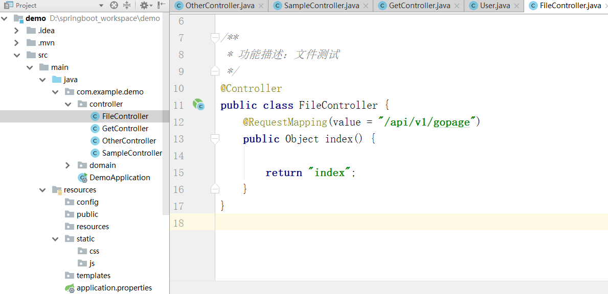

<p class="description"></p>
<meta name="referrer" content="no-referrer" />


<!-- more -->

# springboot官方文档:

```
https://docs.spring.io/spring-boot/docs/2.1.3.RELEASE/reference/htmlsingle/
```

# What is springboot?  

```
Spring Boot makes it easy to create stand-alone, 
production-grade Spring based Applications that you can "just run".

We take an opinionated view of the Spring platform and third-party libraries so you can get started with minimum fuss. 
Most Spring Boot applications need very little Spring configuration.

Spring Boot可以轻松创建独立的，
生产级基于Spring的应用程序，您可以“运行”。

我们对Spring平台和第三方库采取了自以为是的观点，因此您可以尽量少开始。
大多数Spring Boot应用程序只需要很少的Spring配置。
```

# Why use it?

```
Create stand-alone Spring applications

Embed Tomcat, Jetty or Undertow directly (no need to deploy WAR files)

Provide opinionated 'starter' dependencies to simplify your build configuration

Automatically configure Spring and 3rd party libraries whenever possible

Provide production-ready features such as metrics, health checks and externalized configuration

Absolutely no code generation and no requirement for XML configuration

创建独立的Spring应用程序

直接嵌入Tomcat，Jetty或Undertow（无需部署WAR文件）

提供自以为是的“入门”依赖项以简化构建配置

尽可能自动配置Spring和第三方库

提供生产就绪功能，例如指标，运行状况检查和外部化配置

绝对没有代码生成，也不需要XML配置
```

# How to use it?

## 第一章   快速入门

- 进入https://start.spring.io/

- 将下载的包解压并导入IDEA

- 启动我们的项目,访问8080端口

看到找不到页面选项就代表成功,因为我们还没有配置静态资源  

## 第二章   http协议开发

### 1.路由配置

- 首先要明白几个注解

- 创建一个controller

```java
@RequestMapping("/")
    public String home(){
        return "Hello World!";
    }

@RequestMapping("/test")
public Map<String,String> testMap(){
    Map<String,String> map = new HashMap<>();
    map.put("key","value");
    return map;
}
```
- 然后进行测试


### 2.postman接口测试  

```
postman下载地址https://www.getpostman.com/downloads/
```
- 在GetController中添加代码进行测试  


```java
private Map<String,Object> params = new HashMap<>();

    /**
     * 功能描述：测试restful协议，从路径中获取字段
     * @param cityId
     * @param userId
     * @return
     */
    @RequestMapping(path = "/{city_id}/{user_id}", method = RequestMethod.GET)
    public Object findUser(@PathVariable("city_id") String cityId,
                           @PathVariable("user_id") String userId ){
        params.clear();

        params.put("cityId", cityId);
        params.put("userId", userId);

        return params;

    }
```
然后我们用postman进行测试


- GetMapping

```java
 /**
     * 功能描述：测试GetMapping
     * @param from
     * @param size
     * @return
     */
    @GetMapping(value="/v1/page_user1")
    public Object pageUser(int  from, int size ){
        params.clear();
        params.put("from", from);
        params.put("size", size);

        return params;

    }
```
然后我们用postman进行测试


- GetMapping默认值

```java
/**
     * 功能描述：默认值，是否必须的参数
     * @param from
     * @param size
     * @return
     */
    @GetMapping(value="/v1/page_user2")
    public Object pageUserV2(@RequestParam(defaultValue="0",name="page") int  from, int size ){

        params.clear();
        params.put("from", from);
        params.put("size", size);

        return params;

    }
```
然后我们用postman进行测试

如果没有传入参数那么将会启用默认值

- bean对象传参
在domain包下创建一个实体类


```java
public class User {
    private int age;
    private String pwd;
    private int phone;

    public User() {

    }

    public User(int age, String pwd, int phone) {
        this.age = age;
        this.pwd = pwd;
        this.phone = phone;
    }

    public int getAge() {
        return age;
    }

    public void setAge(int age) {
        this.age = age;
    }

    public String getPwd() {
        return pwd;
    }

    public void setPwd(String pwd) {
        this.pwd = pwd;
    }

    public int getPhone() {
        return phone;
    }

    public void setPhone(int phone) {
        this.phone = phone;
    }

    @Override
    public String toString() {
        return "User{" +
                "age=" + age +
                ", pwd='" + pwd + '\'' +
                ", phone=" + phone +
                '}';
    }
}
```


```java
 /**
     * 功能描述：bean对象传参
     * 注意：1、注意需要指定http头为 content-type为application/json
     * 		2、使用body传输数据
     * @param user
     * @return
     */
    @RequestMapping("/v1/save_user")
    public Object saveUser(@RequestBody User user){
        params.clear();
        params.put("user", user);
        return params;
    }
```
然后我们用postman进行测试


- 获取请求头信息

```java
/**
     * 功能描述：测试获取http头信息
     * @param accessToken
     * @param id
     * @return
     */
    @GetMapping("/v1/get_header")
    public Object getHeader(@RequestHeader("access_token") String accessToken, String id){
        params.clear();
        params.put("access_token", accessToken);
        params.put("id", id);
        return params;
    }
```
然后我们用postman进行测试


- post提交方式


```java
private Map<String,Object> params = new HashMap<>();
    /**
     * 功能描述：测试PostMapping
     * @param id
     * @param pwd
     * @return
     */
    @PostMapping("/v1/login")
    public Object login(String id, String pwd){
        params.clear();
        params.put("id", id);
        params.put("pwd", pwd);
        return params;
    }
```

然后我们用postman进行测试


- put提交方式


```java
  @PutMapping("/v1/put")
    public Object put(String id){
        params.clear();
        params.put("id", id);
        return params;
    }
```
然后我们用postman进行测试


- delete提交方式


```java
   @DeleteMapping("/v1/del")
    public Object del(String id){
        params.clear();
        params.put("id", id);
        return params;
    }
```

然后我们用postman进行测试


### 3.常用json框架介绍和jackson返回结果处理
```
常用框架 阿里 fastjson,谷歌gson等  
JavaBean序列化为Json，性能：Jackson > FastJson > Gson > Json-lib 同个结构
Jackson、FastJson、Gson类库各有优点，各有自己的专长
空间换时间，时间换空间
```
为我们的User类添加一个新字段重新生成get/set方法


在SampleController中添加一个新接口
```java
 @GetMapping("/testjson")
    public Object testjson(){

        return new User(111, "abc123", "10001000", new Date());
    }
```
测试结果

但是密码不应该暴露给前端,我们在User类中添加一个注解

添加完之后启动应用再次测试

这样就保证了我们的数据安全

```
类似的注解还有:
指定字段不返回：@JsonIgnore
指定日期格式：@JsonFormat(pattern="yyyy-MM-dd hh:mm:ss",locale="zh",timezone="GMT+8")
空字段不返回：@JsonInclude(Include.NON_NUll)
指定别名：@JsonProperty
```

### 4.springboot目录结构讲解
```
src/main/java：存放代码
src/main/resources
    static: 存放静态文件，比如 css、js、image, （访问方式 http://localhost:8080/js/main.js）
    templates:存放静态页面jsp,html,tpl
    config:存放配置文件,application.properties
    resources:脚本文件

Spring Boot 默认会挨个从
resources > static外 > public 里面找是否存在相应的资源，如果有则直接返回。
src/main/resources目录下资源加载的顺序

```
我们先把restful风格的接口注释掉防止影响

然后按照图中示例进行测试


<font color=red>templates下的文件一般是静态模板没有加入classpath中,直接访问会找不到资源路径需要引入依赖</font>  

在pom文件中引入依赖
```
<dependency>
   <groupId>org.springframework.boot</groupId>
   <artifactId>spring-boot-starter-thymeleaf</artifactId>
</dependency>
```
新建一个FileController

加入代码
```java
 @RequestMapping(value = "/api/v1/gopage")
    public Object index() {

        return "index";
    }
```
在templates文件夹下加入html文件
```html
<!DOCTYPE html>
<html lang="en">
<head>
    <meta charset="UTF-8">
    <title>Title</title>
</head>
<body>
    hello  thymeleaf!!!
</body>
</html>
```
再次访问url


官方默认spring加载静态资源配置路径
```
spring.resources.static-locations = classpath:/META-INF/resources/,classpath:/resources/,classpath:/static/,classpath:/public/ 
```
如果想自定义spring加载静态资源配置路径在后面追加即可(加载的有限顺序调整顺序即可),示例如下:
```
spring.resources.static-locations = classpath:/META-INF/resources/,classpath:/resources/,classpath:/static/,classpath:/public/ ,classpath:/test/
```
### 5.springboot文件上传实战
在static加入上传文件的页面

```html
<!DOCTYPE html>
<html>
  <head>
    <title>uploadimg.html</title>

    <meta name="keywords" content="keyword1,keyword2,keyword3"></meta>
	<meta http-equiv="Content-Type" content="text/html; charset=utf-8" />

    <script src="/js/test.js" type="text/javascript"></script>

  </head>

  <body>
	  <form enctype="multipart/form-data" method="post" action="/upload">
	    文件:<input type="file" name="head_img"/>
	    姓名:<input type="text" name="name"/>
	    <input type="submit" value="上传"/>
	   </form>
   
  </body>
</html>
```
然后在FileController中添加后台代码
<font color=red>注意替换自己存放文件的路径</font>  

```java
//注意替换路径
 private static final String filePath = "D:\\springboot_workspace\\demo\\src\\main\\resources\\static\\image\\";

@RequestMapping(value = "upload")
    @ResponseBody
    public JsonData upload(@RequestParam("head_img") MultipartFile file, HttpServletRequest request) {

        //file.isEmpty(); 判断图片是否为空
        //file.getSize(); 图片大小进行判断

        String name = request.getParameter("name");
        System.out.println("用户名："+name);

        // 获取文件名
        String fileName = file.getOriginalFilename();
        System.out.println("上传的文件名为：" + fileName);

        // 获取文件的后缀名,比如图片的jpeg,png
        String suffixName = fileName.substring(fileName.lastIndexOf("."));
        System.out.println("上传的后缀名为：" + suffixName);

        // 文件上传后的路径
        fileName = UUID.randomUUID() + suffixName;
        System.out.println("转换后的名称:"+fileName);

        File dest = new File(filePath + fileName);

        try {
            //MultipartFile 对象的transferTo方法，用于文件保存（效率和操作比原先用FileOutStream方便和高效）
            file.transferTo(dest);

            return new JsonData(0, fileName);
        } catch (IllegalStateException e) {
            e.printStackTrace();
        } catch (IOException e) {
            e.printStackTrace();
        }
        return  new JsonData(-1, "fail to save ", null);
    }
```
响应的时候应该返回给前台一个包装的json类

```java
	private static final long serialVersionUID = 1L;

	//状态码,0表示成功，-1表示失败
	private int code;
	
	//结果
	private Object data;

	//错误描述
	private String msg;
	
	public int getCode() {
		return code;
	}

	public String getMsg() {
		return msg;
	}

	public void setMsg(String msg) {
		this.msg = msg;
	}

	public void setCode(int code) {
		this.code = code;
	}

	public Object getData() {
		return data;
	}

	public void setData(Object data) {
		this.data = data;
	}

	public JsonData(int code, Object data) {
		super();
		this.code = code;
		this.data = data;
	}

	public JsonData(int code, String msg,Object data) {
		super();
		this.code = code;
		this.msg = msg;
		this.data = data;
	}
```
向后台发送文件之后

这里会有一个问题当上传文件过大时,会抛出异常
### 6.jar包方式启动项目并访问资源


<hr />