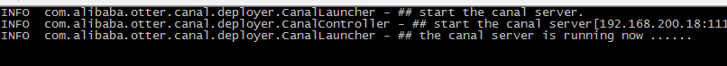
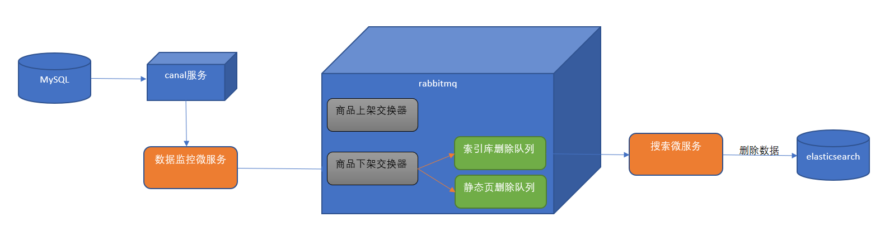

# 第6章 数据同步解决方案-canal

## 学习目标

- 能够完成数据监控微服务的开发
- 能够完成首页广告缓存更新的功能
- 能够完成商品上架索引库导入数据功能，能够画出流程图和说出实现思路
- 能够完成商品下架索引库删除数据功能，能够画出流程图和说出实现思路

## 1. canal

### 1.1 canal简介

canal可以用来监控数据库数据的变化，从而获得新增数据，或者修改的数据。

canal是应阿里巴巴存在杭州和美国的双机房部署，存在<font color="red">跨机房同步</font>的业务需求而提出的。

阿里系公司开始逐步的尝试基于数据库的日志解析，获取增量变更进行同步，由此衍生出了增量订阅&消费的业务。


原理相对比较简单：

1. canal模拟mysql slave的交互协议，伪装自己为mysql slave，向mysql master发送dump协议
2. mysql master收到dump请求，开始推送binary log给slave(也就是canal)
3. canal解析binary log对象(原始为byte流)

### 1.2 环境部署

#### 1.2.1 mysql开启binlog模式

（1）查看当前mysql是否开启binlog模式。

```
SHOW VARIABLES LIKE '%log_bin%'
```


如果log_bin的值为OFF是未开启，为ON是已开启。

（2）修改/etc/my.cnf 需要开启binlog模式。

```
[mysqld]
log-bin=mysql-bin
binlog-format=ROW
server_id=1
```


修改完成之后，重启mysqld的服务。

(3) 进入mysql

```
mysql -h localhost -u root -p
```


（4）创建账号 用于测试使用

使用root账号创建用户并授予权限

```
create user canal@'%' IDENTIFIED by 'canal';
GRANT SELECT, REPLICATION SLAVE, REPLICATION CLIENT,SUPER ON *.* TO 'canal'@'%';
FLUSH PRIVILEGES;
```


#### 1.2.2 canal服务端安装配置

（1）下载地址canal

```
https://github.com/alibaba/canal/releases/tag/canal-1.0.24
```


（2）下载之后 上传到linux系统中，解压缩到指定的目录/usr/local/canal

解压缩之后的目录结构如下：


（3）修改 exmaple下的实例配置

```
vi conf/example/instance.properties
```


修改如图所示的几个参数。

（3）指定读取位置

进入mysql中执行下面语句查看binlog所在位置

```
mysql> show master status;
显示如下:
+------------------+----------+--------------+------------------+-------------------+
| File             | Position | Binlog_Do_DB | Binlog_Ignore_DB | Executed_Gtid_Set |
+------------------+----------+--------------+------------------+-------------------+
| mysql-bin.000001 |      120 |              |                  |                   |
+------------------+----------+--------------+------------------+-------------------+
1 row in set (0.00 sec)
```


如果file中binlog文件不为 mysql-bin.000001 可以重置mysql

```
mysql> reset master;
```


查看canal配置文件

```
vim /usr/local/canal/conf/example/meta.dat
```


找到对应的binlog信息更改一致即可

```
"journalName":"mysql-bin.000001","position":120,"
```


注意：如果不一致，可能导致以下错误

```
2019-06-17 19:35:20.918 [New I/O server worker #1-2] ERROR c.a.otter.canal.server.netty.handler.SessionHandler - something goes wrong with channel:[id: 0x7f2e9be3, /192.168.200.56:52225 => /192.168.200.128:11111], exception=java.io.IOException: Connection reset by peer
```


（4）启动服务：

```
[root@localhost canal]# ./bin/startup.sh
```


（5）查看日志：

```
cat /usr/local/canal/logs/canal/canal.log
```




这样就表示启动成功了。

### 1.3 数据监控微服务

当用户执行数据库的操作的时候，binlog 日志会被canal捕获到，并解析出数据。我们就可以将解析出来的数据进行相应的逻辑处理。

我们这里使用的一个开源的项目，它实现了springboot与canal的集成。比原生的canal更加优雅。

https://github.com/chenqian56131/spring-boot-starter-canal

使用前需要将starter-canal安装到本地仓库。

我们可以参照它提供的canal-test，进行代码实现。

#### 1.3.1 微服务搭建

（1）创建工程模块changgou_canal，pom引入依赖

```
<dependency>
    <groupId>com.xpand</groupId>
    <artifactId>starter-canal</artifactId>
    <version>0.0.1-SNAPSHOT</version>
</dependency>

<dependency>
	<groupId>com.alibaba.otter</groupId>
	<artifactId>canal.client</artifactId>
	<version>1.0.25</version>
</dependency>
```

<font size="5" color="red">少了一个pom</font>

（2）创建包com.changgou.canal ，包下创建启动类

```
@SpringBootApplication
@EnableCanalClient //声明当前的服务是canal的客户端
public class CanalApplication {

    public static void main(String[] args) {
        SpringApplication.run(CanalApplication.class,args);
    }
}
```


（3）添加配置文件application.properties

```
canal.client.instances.example.host=192.168.200.128
canal.client.instances.example.port=11111
canal.client.instances.example.batchSize=1000
spring.rabbitmq.host=192.168.200.128
```


（4）创建com.changgou.canal.listener包，包下创建类

```
@CanalEventListener //声明当前的类是canal的监听类
public class BusinessListener {

    @Autowired
    private RabbitTemplate rabbitTemplate;

    /**
     *
     * @param eventType 当前操作数据库的类型
     * @param rowData 当前操作数据库的数据
     */
    @ListenPoint(schema = "changgou_business",table = "tb_ad")
    public void adUpdate(CanalEntry.EventType eventType,CanalEntry.RowData rowData){
        System.out.println("广告表数据发生改变");
        //获取改变之前的数据
        rowData.getBeforeColumnsList().forEach((c)-> System.out.println("改变前的数据:"+c.getName()+"::"+c.getValue()));

        //获取改变之后的数据
        rowData.getAfterColumnsList().forEach((c)-> System.out.println("改变之后的数据:"+c.getName()+"::"+c.getValue()));
    }
}
```


测试：启动数据监控微服务，修改changgou_business的tb_ad表，观察控制台输出。

<font color="red">有了这个监听之后  运营人员在后台修改首页的banner就可以同步到前台服务了</font>

## 2. 首页广告缓存更新

### 2.1 需求分析

当tb_ad（广告）表的数据发生变化时，更新redis中的广告数据。

### 2.2 实现思路

（1）修改数据监控微服务，监控tb_ad表，当发生增删改操作时，提取position值（广告位置key），发送到rabbitmq

（2）从rabbitmq中提取消息，通过OkHttpClient调用ad_update来实现对广告缓存数据的更新。


### 2.3 代码实现

#### 2.3.1 发送消息到mq

（1）在rabbitmq管理后台创建队列 ad_update_queue ，用于接收广告更新通知


（2）引入rabbitmq起步依赖

```
<dependency>
    <groupId>org.springframework.amqp</groupId>
    <artifactId>spring-rabbit</artifactId>
</dependency>
```


（3）配置文件application.properties 添加内容

```
spring.rabbitmq.host=192.168.200.128
```


（4）新增rabbitMQ配置类

```
@Configuration
public class RabbitMQConfig {

    //定义队列名称
    public static final String AD_UPDATE_QUEUE="ad_update_queue";
   

    //声明队列
    @Bean
    public Queue queue(){
        return new Queue(AD_UPDATE_QUEUE);
    }

}
```


 

（4）修改BusinessListener类

```
@CanalEventListener //声明当前的类是canal的监听类
public class BusinessListener {

    @Autowired
    private RabbitTemplate rabbitTemplate;

    /**
     *
     * @param eventType 当前操作数据库的类型
     * @param rowData 当前操作数据库的数据
     */
    @ListenPoint(schema = "changgou_business",table = "tb_ad")
    public void adUpdate(CanalEntry.EventType eventType,CanalEntry.RowData rowData){
        System.out.println("广告表数据发生改变");

        for (CanalEntry.Column column : rowData.getAfterColumnsList()) {
            if ("position".equals(column.getName())){
                System.out.println("发送最新的数据到MQ:"+column.getValue());

                //发送消息
                rabbitTemplate.convertAndSend("", RabbitMQConfig.AD_UPDATE_QUEUE,column.getValue());
            }
        }
    }
}
```


（5）测试，运行数据监控微服务canal，新增、修改或删除tb_ad表数据，修改后观察控制台输出和rabbitmq管理界面中ad_update_queue是否接收到消息


#### 2.3.2 从mq中提取消息执行更新

（1）changgou_service_business工程pom.xml引入依赖

```
<dependency>
    <groupId>org.springframework.boot</groupId>
    <artifactId>spring-boot-starter-amqp</artifactId>
</dependency>
```


（2）在spring节点下添加rabbitmq配置

```
  rabbitmq:
    host: 192.168.200.128
```


（3）com.changgou.business包下创建listener包，包下创建类

```
@Component
public class AdListener {

    @RabbitListener(queues = "ad_update_queue")
    public void receiveMessage(String message){
        System.out.println("接收到的消息为:"+message);

        //发起远程调用
        OkHttpClient okHttpClient = new OkHttpClient();
        String url = "http://192.168.200.128/ad_update?position="+message;
        Request request = new Request.Builder().url(url).build();
        Call call = okHttpClient.newCall(request);
        call.enqueue(new Callback() {
            @Override
            public void onFailure(Call call, IOException e) {
                //请求失败
                e.printStackTrace();
            }

            @Override
            public void onResponse(Call call, Response response) throws IOException {
                //请求成功
                System.out.println("请求成功:"+response.message());
            }
        });
    }
}
```


（7）测试，启动eureka和business微服务，观察控制台输出和数据同步效果。

## 3. 商品上架索引库导入数据

### 3.1 需求分析

商品上架将商品的sku列表导入或更新索引库。

### 3.2 实现思路

（1）在数据监控微服务中监控tb_spu表的数据，当tb_spu发生更改且is_marketable为1时，表示商品上架，将spu的id发送到rabbitmq。

（2）在rabbitmq管理后台创建商品上架交换器（fanout）。使用分列模式的交换器是考虑商品上架会有很多种逻辑需要处理，导入索引库只是其中一项，另外还有商品详细页静态化等操作。这样我们可以创建导入索引库的队列和商品详细页静态化队列并与商品上架交换器进行绑定。

（3）搜索微服务从rabbitmq的导入索引库的队列中提取spu的id，通过feign调用商品微服务得到sku的列表，并且通过调用elasticsearch的高级restAPI 将sku列表导入到索引库。


### 3.3 代码实现

#### 3.3.1 发送消息到mq

（1）在rabbitmq后台创建交换器goods_up_exchange（类型为fanout），创建队列search_add_queue绑定交换器goods_up_exchange,更新rabbitmq配置类

```
@Configuration
public class RabbitMQConfig {

    //交换机名称
    private static final String GOODS_UP_EXCHANGE="goods_up_exchange";

    //定义队列名称
    private static final String SEARCH_ADD_QUEUE="search_add_queue";

    //定义队列名称
    public static final String AD_UPDATE_QUEUE="ad_update_queue";

    //声明队列
    @Bean
    public Queue queue(){
        return new Queue(AD_UPDATE_QUEUE);
    }

    //声明队列
    @Bean(AD_UPDATE_QUEUE)
    public Queue AD_UPDATE_QUEUE(){
        return new Queue(AD_UPDATE_QUEUE);
    }

    //声明交换机
    @Bean(GOODS_UP_EXCHANGE)
    public Exchange GOODS_UP_EXCHANGE(){
        return ExchangeBuilder.fanoutExchange(GOODS_UP_EXCHANGE).durable(true).build();
    }

    //队列绑定交换机
    @Bean
    public Binding AD_UPDATE_QUEUE_BINDING(@Qualifier(AD_UPDATE_QUEUE) Queue queue,@Qualifier(GOODS_UP_EXCHANGE) Exchange exchange){
        return BindingBuilder.bind(queue).to(exchange).with("").noargs();

    }
}
```


（2）数据监控微服务新增SpuListener，添加以下代码：

```
@CanalEventListener
public class SpuListener {

    @Autowired
    private RabbitTemplate rabbitTemplate;

    @ListenPoint(schema = "changgou_goods",table = "tb_spu")
    public void goodsUp(CanalEntry.EventType eventType,CanalEntry.RowData rowData){
        //获取改变之前的数据并将这部分数据转换为map
        Map<String,String> oldData=new HashMap<>();
        rowData.getBeforeColumnsList().forEach((c)->oldData.put(c.getName(),c.getValue()));

        //获取改变之后的数据并这部分数据转换为map
        Map<String,String> newData = new HashMap<>();
        rowData.getAfterColumnsList().forEach((c)->newData.put(c.getName(),c.getValue()));

        //获取最新上架的商品 0->1
        if ("0".equals(oldData.get("is_marketable")) && "1".equals(newData.get("is_marketable"))){
            //将商品的spuid发送到mq
            rabbitTemplate.convertAndSend(RabbitMQConfig.GOODS_UP_EXCHANGE,"",newData.get("id"));
        }
    }
}
```


#### 3.3.2 索引库环境准备

我们提供的虚拟机镜像中已经包含了elasticsearch的相关docker镜像

 

#### 3.3.3 创建索引结构

新建changgou_service_search_api模块,并添加索引库实体类

(1) 添加依赖

```
<dependencies>
  <dependency>
    <groupId>com.changgou</groupId>
    <artifactId>changgou_common</artifactId>
    <version>1.0-SNAPSHOT</version>
  </dependency>
  <dependency>
    <groupId>org.springframework.boot</groupId>
    <artifactId>spring-boot-starter-data-elasticsearch</artifactId>
  </dependency>
</dependencies>
```


(2) 创建实体类

```
@Document(indexName = "skuinfo", type = "docs")
public class SkuInfo implements Serializable {
    //商品id，同时也是商品编号
    @Id
    @Field(index = true, store = true, type = FieldType.Keyword)
    private Long id;

    //SKU名称
    @Field(index = true, store = true, type = FieldType.Text, analyzer = "ik_smart")
    private String name;

    //商品价格，单位为：元
    @Field(index = true, store = true, type = FieldType.Double)
    private Long price;

    //库存数量
    @Field(index = true, store = true, type = FieldType.Integer)
    private Integer num;

    //商品图片
    @Field(index = false, store = true, type = FieldType.Text)
    private String image;

    //商品状态，1-正常，2-下架，3-删除
    @Field(index = true, store = true, type = FieldType.Keyword)
    private String status;

    //创建时间
    private Date createTime;

    //更新时间
    private Date updateTime;

    //是否默认
    @Field(index = true, store = true, type = FieldType.Keyword)
    private String isDefault;

    //SPUID
    @Field(index = true, store = true, type = FieldType.Long)
    private Long spuId;

    //类目ID
    @Field(index = true, store = true, type = FieldType.Long)
    private Long categoryId;

    //类目名称
    @Field(index = true, store = true, type = FieldType.Keyword)
    private String categoryName;

    //品牌名称
    @Field(index = true, store = true, type = FieldType.Keyword)
    private String brandName;

    //规格
    private String spec;

    //规格参数
    private Map<String, Object> specMap;
    
    //getter & setter略
}
```


 

#### 3.3.4 搜索微服务搭建

（1）创建changgou_service_search模块，pom.xml引入依赖

```
<dependencies>
  <dependency>
    <groupId>com.changgou</groupId>
    <artifactId>changgou_common</artifactId>
    <version>1.0-SNAPSHOT</version>
  </dependency>
  <dependency>
    <groupId>org.springframework.cloud</groupId>
    <artifactId>spring-cloud-starter-netflix-eureka-client</artifactId>
  </dependency>
  <dependency>
    <groupId>org.springframework.boot</groupId>
    <artifactId>spring-boot-starter-data-elasticsearch</artifactId>
  </dependency>
  <dependency>
    <groupId>com.changgou</groupId>
    <artifactId>changgou_service_goods_api</artifactId>
    <version>1.0-SNAPSHOT</version>
  </dependency>
  <dependency>
    <groupId>com.changgou</groupId>
    <artifactId>changgou_service_search_api</artifactId>
    <version>1.0-SNAPSHOT</version>
  </dependency>
  <dependency>
    <groupId>org.springframework.boot</groupId>
    <artifactId>spring-boot-starter-amqp</artifactId>
  </dependency>
</dependencies>
```


（2）changgou_service_search的application.yml

```
server:
  port: 9009
spring:
  application:
    name: search
  rabbitmq:
    host: 192.168.200.128
  redis:
    host: 192.168.200.128
  main:
    allow-bean-definition-overriding: true #当遇到同样名字的时候，是否允许覆盖注册
  data:
    elasticsearch:
      cluster-name: elasticsearch
      cluster-nodes: 192.168.200.128:9300
  thymeleaf:
    cache: false
eureka:
  client:
    service-url:
      defaultZone: http://127.0.0.1:6868/eureka
  instance:
    prefer-ip-address: true
feign:
  hystrix:
    enabled: true
  client:
    config:
      default:   #配置全局的feign的调用超时时间  如果 有指定的服务配置 默认的配置不会生效
        connectTimeout: 600000 # 指定的是 消费者 连接服务提供者的连接超时时间 是否能连接  单位是毫秒
        readTimeout: 600000  # 指定的是调用服务提供者的 服务 的超时时间（）  单位是毫秒
#hystrix 配置
hystrix:
  command:
    default:
      execution:
        timeout:
          #如果enabled设置为false，则请求超时交给ribbon控制
          enabled: false
        isolation:
          strategy: SEMAPHORE
```


（3）创建com.changgou包，包下创建SearchApplication

```
@SpringBootApplication
@EnableEurekaClient
@EnableFeignClients(basePackages = {"com.changgou.goods.feign"})
public class SearchApplication {

    public static void main(String[] args) {
        SpringApplication.run(SearchApplication.class,args);
    }
}
```


(4) 将rabbitmq配置类放入该模块下

#### 3.3.5 商品服务查询商品信息

(1) SkuController新增方法

```
@GetMapping("/spu/{spuId}")
    public List<Sku> findSkuListBySpuId(@PathVariable("spuId") String spuId){
        Map<String,Object> searchMap = new HashMap<>();

        if (!"all".equals(spuId)){
            searchMap.put("spuId",spuId);
        }
        searchMap.put("status","1");
        List<Sku> skuList = skuService.findList(searchMap);

        return skuList;
    }
```


(2) changgou_service_goods_api新增common依赖

```
<dependencies>
  <dependency>
    <groupId>com.changgou</groupId>
    <artifactId>changgou_common</artifactId>
    <version>1.0-SNAPSHOT</version>
  </dependency>
</dependencies>
```


(3) 定义skuFegin接口

```
@FeignClient(name="goods")
@RequestMapping("/sku")
public interface SkuFeign {

    /***
     * 多条件搜索品牌数据
     * @param spuId
     * @return
     */
    @GetMapping("/sku/spu/{spuId}")
    public List<Sku> findSkuListBySpuId(@PathVariable("spuId") String spuId);
}
```


 

#### 3.3.6 搜索微服务批量导入数据逻辑

(1) 创建 com.changgou.search.dao包,并新增ESManagerMapper接口

```
public interface ESManagerMapper extends ElasticsearchRepository<SkuInfo,Long> {
}
```


 

（2）创建 com.changgou.search.service包，包下创建接口EsManagerService

```
public interface SkuSearchService {

     /**
     * 创建索引库结构
     */
    public void createIndexAndMapping();
  
    /**
     * 导入全部数据到ES索引库
     */
    public void importAll();
  
     /**
     * 根据spuid导入数据到ES索引库
     * @param spuId 商品id
     */
    public void importDataToESBySpuId(String spuId);

}
```


（2）创建com.changgou.search.service.impl包，包下创建服务实现类

```
@Service
public class ESManagerServiceImpl implements ESManagerService {

    @Autowired
    private ElasticsearchTemplate elasticsearchTemplate;

    @Autowired
    private SkuFeign skuFeign;

    @Autowired
    private ESManagerMapper esManagerMapper;

    //创建索引库结构
    @Override
    public void createMappingAndIndex() {
        //创建索引
        elasticsearchTemplate.createIndex(SkuInfo.class);
        //创建映射
        elasticsearchTemplate.putMapping(SkuInfo.class);
    }

    //导入全部sku集合进入到索引库
    @Override
    public void importAll() {
        //查询sku集合
        List<Sku> skuList = skuFeign.findSkuListBySpuId("all");
        if (skuList == null || skuList.size()<=0){
            throw new RuntimeException("当前没有数据被查询到,无法导入索引库");
        }

        //skulist转换为json
        String jsonSkuList = JSON.toJSONString(skuList);
        //将json转换为skuinfo
        List<SkuInfo> skuInfoList = JSON.parseArray(jsonSkuList, SkuInfo.class);

        for (SkuInfo skuInfo : skuInfoList) {
            //将规格信息转换为map
            Map specMap = JSON.parseObject(skuInfo.getSpec(), Map.class);
            skuInfo.setSpecMap(specMap);
        }

        //导入索引库
        esManagerMapper.saveAll(skuInfoList);
    }

    //根据spuid查询skuList,添加到索引库
    @Override
    public void importDataBySpuId(String spuId) {
        List<Sku> skuList = skuFeign.findSkuListBySpuId(spuId);
        if (skuList == null || skuList.size()<=0){
            throw new RuntimeException("当前没有数据被查询到,无法导入索引库");
        }
        //将集合转换为json
        String jsonSkuList = JSON.toJSONString(skuList);
        List<SkuInfo> skuInfoList = JSON.parseArray(jsonSkuList, SkuInfo.class);

        for (SkuInfo skuInfo : skuInfoList) {
            //将规格信息进行转换
            Map specMap = JSON.parseObject(skuInfo.getSpec(), Map.class);
            skuInfo.setSpecMap(specMap);
        }

        //添加索引库
        esManagerMapper.saveAll(skuInfoList);
    }

}
```


(3) 创建com.changgou.search.controller.定义ESManagerController

```
@RestController
@RequestMapping("/manager")
public class ESManagerController {

    @Autowired
    private ESManagerService esManagerService;

    //创建索引库结构
    @GetMapping("/create")
    public Result create(){
        esManagerService.createMappingAndIndex();
        return new Result(true, StatusCode.OK,"创建索引库结构成功");
    }

    //导入全部数据
    @GetMapping("/importAll")
    public Result importAll(){
        esManagerService.importAll();
        return new Result(true, StatusCode.OK,"导入全部数据成功");
    }
}
```


 

#### 3.3.7 接收mq消息执行导入

changgou_service_search工程创建com.changgou.search.listener包，包下创建类

```
@Component
public class GoodsUpListener {

    @Autowired
    private ESManagerService esManagerService;

    @RabbitListener(queues = RabbitMQConfig.SEARCH_ADD_QUEUE)
    public void receiveMessage(String spuId){
        System.out.println("接收到的消息为:   "+spuId);

        //查询skulist,并导入到索引库
        esManagerService.importDataBySpuId(spuId);
    }
}
```


#### 3.3.8 测试

（1）启动环境 eureka 、elasticsearch 、canal服务端、canal数据监控微服务、rabbitmq

（2）启动商品微服务、搜索微服务

（3）修改tb_spu某记录的is_marketable值为1，观察控制台输出，启动kibana查询记录是否导入成功

 

## 4. 商品下架索引库删除数据

### 4.1 需求分析

商品下架后将商品从索引库中移除。

### 4.2 实现思路

与商品上架的实现思路非常类似。

（1）在数据监控微服务中监控tb_spu表的数据，当tb_spu发生更改且is_marketable为0时，表示商品下架，将spu的id发送到rabbitmq。

（2）在rabbitmq管理后台创建商品下架交换器（fanout）。使用分列模式的交换器是考虑商品下架会有很多种逻辑需要处理，索引库删除数据只是其中一项，另外还有删除商品详细页等操作。

（3）搜索微服务从rabbitmq的的队列中提取spu的id，通过调用elasticsearch的高级restAPI 将相关的sku列表从索引库删除。

 



### 4.3 代码实现

根据上边讲解的实现思路完成商品下架索引库删除数据的功能

#### 4.3.1 创建交换器与队列

完成商品下架交换器的创建，队列的创建与绑定，将spuId发送消息到mq

商品下架交换器：goods_down_exchange

队列名称： search_delete_queue

绑定 search_delete_queue到goods_down_exchange

```
@Configuration
public class RabbitMQConfig {

    //定义交换机名称
    public static final String GOODS_UP_EXCHANGE="goods_up_exchange";
    public static final String GOODS_DOWN_EXCHANGE="goods_down_exchange";

    //定义队列名称
    public static final String AD_UPDATE_QUEUE="ad_update_queue";
    public static final String SEARCH_ADD_QUEUE="search_add_queue";
    public static final String SEARCH_DEL_QUEUE="search_del_queue";

    //声明队列
    @Bean
    public Queue queue(){
        return new Queue(AD_UPDATE_QUEUE);
    }
    @Bean(SEARCH_ADD_QUEUE)
    public Queue SEARCH_ADD_QUEUE(){
        return new Queue(SEARCH_ADD_QUEUE);
    }
    @Bean(SEARCH_DEL_QUEUE)
    public Queue SEARCH_DEL_QUEUE(){
        return new Queue(SEARCH_DEL_QUEUE);
    }

    //声明交换机
    @Bean(GOODS_UP_EXCHANGE)
    public Exchange GOODS_UP_EXCHANGE(){
        return ExchangeBuilder.fanoutExchange(GOODS_UP_EXCHANGE).durable(true).build();
    }
    @Bean(GOODS_DOWN_EXCHANGE)
    public Exchange GOODS_DOWN_EXCHANGE(){
        return ExchangeBuilder.fanoutExchange(GOODS_DOWN_EXCHANGE).durable(true).build();
    }


    //队列与交换机的绑定
    @Bean
    public Binding GOODS_UP_EXCHANGE_BINDING(@Qualifier(SEARCH_ADD_QUEUE)Queue queue,@Qualifier(GOODS_UP_EXCHANGE)Exchange exchange){
        return BindingBuilder.bind(queue).to(exchange).with("").noargs();
    }
    @Bean
    public Binding GOODS_DOWN_EXCHANGE_BINDING(@Qualifier(SEARCH_DEL_QUEUE)Queue queue,@Qualifier(GOODS_DOWN_EXCHANGE)Exchange exchange){
        return BindingBuilder.bind(queue).to(exchange).with("").noargs();
    }

}
```


#### 4.3.2 canal监听下架

修改changgou_canal的SpuListener的spuUpdate方法，添加以下代码

```
//获取最新下架的商品 1->0
if ("1".equals(oldData.get("is_marketable")) && "0".equals(newData.get("is_marketable"))){
    //将商品的spuid发送到mq
    rabbitTemplate.convertAndSend(RabbitMQConfig.GOODS_DOWN_EXCHANGE,"",newData.get("id"));
}
```


 

#### 4.3.3 根据spuId删除索引数据

编写业务逻辑，实现根据spuId删除索引库数据的方法。

（1）ESManagerService新增方法定义

```
//根据souid删除es索引库中相关的sku数据
void delDataBySpuId(String spuId);
```


（2）ESManagerServiceImpl实现方法

```
@Override
public void delDataBySpuId(String spuId) {
    List<Sku> skuList = skuFeign.findSkuListBySpuId(spuId);
    if (skuList == null || skuList.size()<=0){
        throw new RuntimeException("当前没有数据被查询到,无法导入索引库");
    }
    for (Sku sku : skuList) {
        esManagerMapper.deleteById(Long.parseLong(sku.getId()));
    }
}
```


 

#### 4.3.4 接收mq消息，执行索引库删除

从rabbitmq中提取消息，调动根据spuId删除索引库数据的方法 changgou_service_search新增监听类

```
@Component
public class GoodsDelListener {

    @Autowired
    private ESManagerService esManagerService;

    @RabbitListener(queues = RabbitMQConfig.SEARCH_DEL_QUEUE)
    public void receiveMessage(String spuId){
        System.out.println("删除索引库监听类,接收到的spuId:  "+spuId);

        //调用业务层完成索引库数据删除
        esManagerService.delDataBySpuId(spuId);
    }
}
```