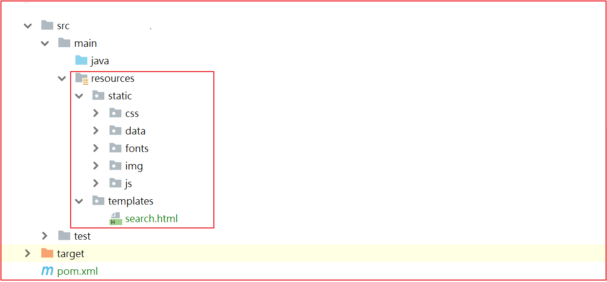

# 第8章 Thymeleaf

## 学习目标

- Thymeleaf的介绍
- Thymeleaf的入门
- Thymeleaf的语法及标签
- 搜索页面渲染
- 商品详情页静态化功能实现

 

## 1.Thymeleaf介绍

thymeleaf是一个XML/XHTML/HTML5模板引擎，可用于Web与非Web环境中的应用开发。它是一个开源的Java库，基于Apache License 2.0许可，由Daniel Fernández创建，该作者还是Java加密库Jasypt的作者。

Thymeleaf提供了一个用于整合Spring MVC的可选模块，在应用开发中，你可以使用Thymeleaf来完全代替JSP或其他模板引擎，如Velocity、FreeMarker等。Thymeleaf的主要目标在于提供一种可被浏览器正确显示的、格式良好的模板创建方式，因此也可以用作静态建模。你可以使用它创建经过验证的XML与HTML模板。相对于编写逻辑或代码，开发者只需将标签属性添加到模板中即可。接下来，这些标签属性就会在DOM（文档对象模型）上执行预先制定好的逻辑。

 

它的特点便是：开箱即用，Thymeleaf允许您处理六种模板，每种模板称为模板模式：

- XML
- 有效的XML
- XHTML
- 有效的XHTML
- HTML5
- 旧版HTML5

所有这些模式都指的是格式良好的XML文件，但*Legacy HTML5*模式除外，它允许您处理HTML5文件，其中包含独立（非关闭）标记，没有值的标记属性或不在引号之间写入的标记属性。为了在这种特定模式下处理文件，Thymeleaf将首先执行转换，将您的文件转换为格式良好的XML文件，这些文件仍然是完全有效的HTML5（实际上是创建HTML5代码的推荐方法）[1](https://www.thymeleaf.org/doc/tutorials/2.1/usingthymeleaf.html#fn1)。

另请注意，验证仅适用于XML和XHTML模板。

然而，这些并不是Thymeleaf可以处理的唯一模板类型，并且用户始终能够通过指定在此模式下*解析*模板的方法和*编写*结果的方式来定义他/她自己的模式。这样，任何可以建模为DOM树（无论是否为XML）的东西都可以被Thymeleaf有效地作为模板处理。

 

## 2.Springboot整合thymeleaf

使用springboot 来集成使用Thymeleaf可以大大减少单纯使用thymleaf的代码量，所以我们接下来使用springboot集成使用thymeleaf.

实现的步骤为：

- 创建一个sprinboot项目
- 添加thymeleaf的起步依赖
- 添加spring web的起步依赖
- 编写html 使用thymleaf的语法获取变量对应后台传递的值
- 编写controller 设置变量的值到model中

 

(1)创建工程

创建一个独立的工程springboot-thymeleaf,该工程为案例工程，不需要放到changgou工程中。

**pom.xml依赖**


```
<?xml version="1.0" encoding="UTF-8"?>
<project xmlns="http://maven.apache.org/POM/4.0.0"
         xmlns:xsi="http://www.w3.org/2001/XMLSchema-instance"
         xsi:schemaLocation="http://maven.apache.org/POM/4.0.0 http://maven.apache.org/xsd/maven-4.0.0.xsd">
    <modelVersion>4.0.0</modelVersion>

    <groupId>com.itheima</groupId>
    <artifactId>springboot-thymeleaf</artifactId>
    <version>1.0-SNAPSHOT</version>

    <parent>
        <groupId>org.springframework.boot</groupId>
        <artifactId>spring-boot-starter-parent</artifactId>
        <version>2.1.4.RELEASE</version>
    </parent>

    <dependencies>
        <!--web起步依赖-->
        <dependency>
            <groupId>org.springframework.boot</groupId>
            <artifactId>spring-boot-starter-web</artifactId>
        </dependency>

        <!--thymeleaf配置-->
        <dependency>
            <groupId>org.springframework.boot</groupId>
            <artifactId>spring-boot-starter-thymeleaf</artifactId>
        </dependency>
    </dependencies>
</project>
```


(2)创建包com.itheima.thymeleaf.并创建启动类ThymeleafApplication


```

```


```
@SpringBootApplication
public class ThymeleafApplication {

    public static void main(String[] args) {
        SpringApplication.run(ThymeleafApplication.class,args);
    }
}
```


 

(3)创建application.yml

设置thymeleaf的缓存设置，设置为false。默认加缓存的，用于测试。


```

```


```
spring:
  thymeleaf:
    cache: false
```


 

(4)控制层

创建controller用于测试后台 设置数据到model中。

创建com.itheima.controller.TestController，代码如下：


```

```


```
@Controller
@RequestMapping("/test")
public class TestController {

    /***
     * 访问/test/hello  跳转到demo1页面
     * @param model
     * @return
     */
    @RequestMapping("/hello")
    public String hello(Model model){
        model.addAttribute("hello","hello welcome");
        return "demo";
    }
}
```


 

(2)创建html

在resources中创建templates目录，在templates目录创建 demo.html,代码如下：


```

```


```
<!DOCTYPE html>
<html xmlns:th="http://www.thymeleaf.org">
<head>
    <title>Thymeleaf的入门</title>
    <meta http-equiv="Content-Type" content="text/html; charset=UTF-8"/>
</head>
<body>
<!--输出hello数据-->
<p th:text="${hello}"></p>
</body>
</html>
```


解释：

`<html xmlns:th="http://www.thymeleaf.org">`:这句声明使用thymeleaf标签

<p th:text="${hello}"></p>:这句使用 th:text="${变量名}" 表示 使用thymeleaf获取文本数据，类似于EL表达式。

 

 

 

(5)测试

启动系统，并在浏览器访问


```

```


```
http://localhost:8080/test/hello
```


 

## 3 Thymeleaf基本语法

(1)th:action

定义后台控制器路径，类似`<form>`标签的action属性。

例如：


```

```


```
<form th:action="@{/test/hello}" >
```

```
    <input th:type="text"  th:name="id">
```

```
    <button>提交</button>
```

```
</form>
```


 

(2)th:each

对象遍历，功能类似jstl中的`<c:forEach>`标签。

创建com.itheima.model.User,代码如下：


```

```


```
public class User {
```

```
    private Integer id;
```

```
    private String name;
```

```
    private String address;
```

```
    //..get..set
```

```
}
```


 

Controller添加数据


```

```


```
/***
```

```
 * 访问/test/hello  跳转到demo1页面
```

```
 * @param model
```

```
 * @return
```

```
 */
```

```
@RequestMapping("/hello")
```

```
public String hello(Model model){
```

```
    model.addAttribute("hello","hello welcome");
```

```

```

```
    //集合数据
```

```
    List<User> users = new ArrayList<User>();
```

```
    users.add(new User(1,"张三","深圳"));
```

```
    users.add(new User(2,"李四","北京"));
```

```
    users.add(new User(3,"王五","武汉"));
```

```
    model.addAttribute("users",users);
```

```
    return "demo1";
```

```
}
```


 

页面输出


```

```


```
<table>
```

```
    <tr>
```

```
        <td>下标</td>
```

```
        <td>编号</td>
```

```
        <td>姓名</td>
```

```
        <td>住址</td>
```

```
    </tr>
```

```
    <tr th:each="user,userStat:${users}">
```

```
        <td>
```

```
            下标:<span th:text="${userStat.index}"></span>,
```

```
        </td>
```

```
        <td th:text="${user.id}"></td>
```

```
        <td th:text="${user.name}"></td>
```

```
        <td th:text="${user.address}"></td>
```

```
    </tr>
```

```
</table>
```


 

测试效果


 

(3)Map输出

后台添加Map


```

```


```
//Map定义
```

```
Map<String,Object> dataMap = new HashMap<String,Object>();
```

```
dataMap.put("No","123");
```

```
dataMap.put("address","深圳");
```

```
model.addAttribute("dataMap",dataMap);
```


 

 

页面输出


```

```


```
<div th:each="map,mapStat:${dataMap}">
```

```
    <div th:text="${map}"></div>
```

```
    key:<span th:text="${mapStat.current.key}"></span><br/>
```

```
    value:<span th:text="${mapStat.current.value}"></span><br/>
```

```
    ==============================================
```

```
</div>
```


 

测试效果


 

(4)数组输出

后台添加数组


```

```


```
//存储一个数组
```

```
String[] names = {"张三","李四","王五"};
```

```
model.addAttribute("names",names);
```


页面输出


```

```


```
<div th:each="nm,nmStat:${names}">
```

```
    <span th:text="${nmStat.count}"></span><span th:text="${nm}"></span>
```

```
    ==============================================
```

```
</div>
```


 

测试效果


 

 

(5)Date输出

后台添加日期


```

```


```
//日期
```

```
model.addAttribute("now",new Date());
```


页面输出


```

```


```
<div>
```

```
    <span th:text="${#dates.format(now,'yyyy-MM-dd hh:ss:mm')}"></span>
```

```
</div>
```


 

测试效果


 

(6)th:if条件

后台添加年龄


```

```


```
//if条件
```

```
model.addAttribute("age",22);
```


 

页面输出


```

```


```
<div>
```

```
    <span th:if="${(age>=18)}">终于长大了！</span>
```

```
</div>
```


 

测试效果


 

(7)th:fragment 定义一个模块

可以定义一个独立的模块，创建一个footer.html代码如下：


```

```


```
<!DOCTYPE html>
```

```
<html xmlns:th="http://www.thymeleaf.org">
```

```
<head>
```

```
    <meta http-equiv="Content-Type" content="text/html;charset=charset=utf-8">
```

```
    <title>fragment</title>
```

```
</head>
```

```
<body>
```

```
<div id="C" th:fragment="copy" >
```

```
    关于我们<br/>
```

```
</div>
```

```
</body>
```


 

(8)th:include

可以直接引入`th:fragment`,在demo1.html中引入如下代码：


```

```


```
<div id="A" th:include="footer::copy"></div>
```


 

效果如下：


 

 

## 4 搜索页面渲染

### 4.1 搜索分析


搜索页面要显示的内容主要分为3块。

1)搜索的数据结果

2)筛选出的数据搜索条件

3)用户已经勾选的数据条件

 

### 4.2 搜索实现


搜索的业务流程如上图，用户每次搜索的时候，先经过搜索业务工程，搜索业务工程调用搜索微服务工程。

 

#### 4.2.1 搜索工程搭建

(1)引入依赖

在changgou-service_search工程中的pom.xml中引入如下依赖：


```

```


```
<dependency>
```

```
  <groupId>org.springframework.boot</groupId>
```

```
  <artifactId>spring-boot-starter-thymeleaf</artifactId>
```

```
</dependency>
```


 

(2)静态资源导入

将资源中的`页面资源/所有内容`拷贝到工程的`resources`目录下如下图：



(3) 更改配置文件,在spring下添加内容


```

```


```
thymeleaf:
```

```
    cache: false
```


 

#### 4.2.1 基础数据渲染

(1)更新SearchController,定义跳转搜索结果页面方法

代码如下：


```

```


```
    //搜索页面   http://localhost:9009/search/list?keywords=手机&brand=三星&spec_颜色=粉色&
```

```
    //入参：Map
```

```
    //返回值 Map
```

```
    //由于页面是thymeleaf 完成的 属于服务器内页面渲染 跳转页面
```

```
    @GetMapping("/list")
```

```
    public String search(@RequestParam Map<String, String> searchMap, Model model) throws Exception {
```

```

```

```
        //特殊符号处理
```

```
        handlerSearchMap(searchMap);
```

```

```

```
        //执行查询返回值
```

```
        Map<String, Object> resultMap = searchService.search(searchMap);
```

```

```

```
        model.addAttribute("searchMap", searchMap);
```

```
        model.addAttribute("result", resultMap);
```

```
        return "search";
```

```
    }
```

```

```

```
}
```


 

(2) 搜索结果页面渲染

(2.1)用户选择条件回显


```

```


```
<div class="bread">
```

```
                <ul class="fl sui-breadcrumb">
```

```
                    <li>
```

```
                        <a href="#">全部结果</a>
```

```
                    </li>
```

```
                    <li class="active">
```

```
                        <span th:text="${searchMap.keywords}"></span>
```

```
                    </li>
```

```
                </ul>
```

```
                <ul class="fl sui-tag">
```

```
                    <!-- 品牌-->
```

```
                    <li class="with-x" th:if="${#maps.containsKey(searchMap,'brand')}">
```

```
                        品牌:<span th:text="${searchMap.brand}"></span>
```

```
                        <i>×</i>
```

```
                    </li>
```

```
                    <!-- 价格-->
```

```
                    <li class="with-x" th:if="${#maps.containsKey(searchMap,'price')}">
```

```
                        价格:<span th:text="${searchMap.price}"></span>
```

```
                        <i>×</i>
```

```
                    </li>
```

```
                    <!-- 规格-->
```

```
                    <li class="with-x" th:each="sm:${searchMap}" th:if="${#strings.startsWith(sm.key,'spec_')}">
```

```
                        <span th:text="${#strings.replace(sm.key,'spec_','')}"></span>:<span th:text="${#strings.replace(sm.value,'%2B','+')}"></span>
```

```
                        <i>×</i>
```

```
                    </li>
```

```
                </ul>
```

```
                <form class="fl sui-form form-dark">
```

```
                    <div class="input-control control-right">
```

```
                        <input type="text" />
```

```
                        <i class="sui-icon icon-touch-magnifier"></i>
```

```
                    </div>
```

```
                </form>
```

```
            </div>
```


 

(2.2)商品属性及规格显示

更新搜索业务层实现


```

```


```
 public Map<String, Set<String>> formartSpec(List<String> specList){
```

```
        Map<String,Set<String>> resultMap = new HashMap<>();
```

```
        if (specList!=null && specList.size()>0){
```

```
            for (String specJsonString : specList) {  //"{'颜色': '黑色', '尺码': '250度'}"
```

```
                //将获取到的json转换为map
```

```
                Map<String,String> specMap = JSON.parseObject(specJsonString, Map.class);
```

```
                for (String specKey : specMap.keySet()) {
```

```
                    Set<String> specSet = resultMap.get(specKey);
```

```
                    if (specSet == null){
```

```
                        specSet = new HashSet<String>();
```

```
                    }
```

```
                    //将规格信息存入set中
```

```
                    specSet.add(specMap.get(specKey));
```

```
                    //将set存入map
```

```
                    resultMap.put(specKey,specSet);
```

```
                }
```

```
            }
```

```
        }
```

```
        return resultMap;
```

```
    }
```


更新页面


```

```


```
<div class="clearfix selector">
```

```
                <div class="type-wrap logo" th:unless="${#maps.containsKey(searchMap,'brand')}">
```

```
                    <div class="fl key brand">品牌</div>
```

```
                    <div class="value logos">
```

```
                        <ul class="logo-list">
```

```
                            <li th:each="brand,brandStat:${result.brandList}">
```

```
                                <a th:text="${brand}"></a>
```

```
                            </li>
```

```
                        </ul>
```

```
                    </div>
```

```
                    <div class="ext">
```

```
                        <a href="javascript:void(0);" class="sui-btn">多选</a>
```

```
                        <a href="javascript:void(0);">更多</a>
```

```
                    </div>
```

```
                </div>
```

```
                <div class="type-wrap" th:each="spec,specStat:${result.specList}" th:unless="${#maps.containsKey(searchMap,'spec_'+spec.key)}">
```

```
                    <div class="fl key" th:text="${spec.key}"></div>
```

```
                    <div class="fl value">
```

```
                        <ul class="type-list">
```

```
                            <li th:each="op,opStat:${spec.value}">
```

```
                                <a th:text="${op}"></a>
```

```
                            </li>
```

```
                        </ul>
```

```
                    </div>
```

```
                    <div class="fl ext"></div>
```

```
                </div>
```

```

```

```
                <div class="type-wrap" th:unless="${#maps.containsKey(searchMap,'price')}">
```

```
                    <div class="fl key">价格</div>
```

```
                    <div class="fl value">
```

```
                        <ul class="type-list">
```

```
                            <li>
```

```
                                <a th:text="0-500元"></a>
```

```
                            </li>
```

```
                            <li>
```

```
                                <a th:text="500-1000元"></a>
```

```
                            </li>
```

```
                            <li>
```

```
                                <a th:text="1000-1500元"></a>
```

```
                            </li>
```

```
                            <li>
```

```
                                <a th:text="1500-2000元"></a>
```

```
                            </li>
```

```
                            <li>
```

```
                                <a th:text="2000-3000元"></a>
```

```
                            </li>
```

```
                            <li>
```

```
                                <a th:text="3000元以上"></a>
```

```
                            </li>
```

```
                        </ul>
```

```
                    </div>
```

```
                    <div class="fl ext">
```

```
                    </div>
```

```
                </div>
```

```
                <div class="type-wrap">
```

```
                    <div class="fl key">更多筛选项</div>
```

```
                    <div class="fl value">
```

```
                        <ul class="type-list">
```

```
                            <li>
```

```
                                <a>特点</a>
```

```
                            </li>
```

```
                            <li>
```

```
                                <a>系统</a>
```

```
                            </li>
```

```
                            <li>
```

```
                                <a>手机内存 </a>
```

```
                            </li>
```

```
                            <li>
```

```
                                <a>单卡双卡</a>
```

```
                            </li>
```

```
                            <li>
```

```
                                <a>其他</a>
```

```
                            </li>
```

```
                        </ul>
```

```
                    </div>
```

```
                    <div class="fl ext">
```

```
                    </div>
```

```
                </div>
```

```
            </div>
```


 

(2.3)商品列表显示


```

```


```
<div class="goods-list">
```

```
                    <ul class="yui3-g">
```

```
                        <li class="yui3-u-1-5" th:each="sku,skuStat:${result.rows}">
```

```
                            <div class="list-wrap">
```

```
                                <div class="p-img">
```

```
                                    <a href="item.html"  target="_blank"></a>
```

```
                                </div>
```

```
                                <div class="price">
```

```
                                    <strong>
```

```
                                            <em>¥</em>
```

```
                                            <i th:text="${sku.price}"></i>
```

```
                                        </strong>
```

```
                                </div>
```

```
                                <div class="attr">
```

```
                                    <a target="_blank" href="item.html"  th:title="${sku.spec}" th:utext="${sku.name}">Apple苹果iPhone 6s (A1699)Apple苹果iPhone 6s (A1699)Apple苹果iPhone 6s (A1699)Apple苹果iPhone 6s (A1699)</a>
```

```
                                </div>
```

```
                                <div class="commit">
```

```
                                    <i class="command">已有<span>2000</span>人评价</i>
```

```
                                </div>
```

```
                                <div class="operate">
```

```
                                    <a href="success-cart.html" target="_blank" class="sui-btn btn-bordered btn-danger">加入购物车</a>
```

```
                                    <a href="javascript:void(0);" class="sui-btn btn-bordered">收藏</a>
```

```
                                </div>
```

```
                            </div>
```

```
                        </li>
```

```
                    </ul>
```

```
                </div>
```


 

### 4.3 关键字搜索

修改search.html


```

```


```
<form  th:action="@{/search/list}" class="sui-form form-inline">
```

```
  <!--searchAutoComplete-->
```

```
  <div class="input-append">
```

```
    <input type="text" id="autocomplete" name="keywords" th:value="${searchMap.keywords}"   class="input-error input-xxlarge" />
```

```
    <button class="sui-btn btn-xlarge btn-danger"  th:type="submit">搜索</button>
```

```
  </div>
```

```
</form>
```


测试

搜索`华为`关键字,效果如下：


 

 

### 4.4 条件搜索实现


用户每次点击搜索的时候，其实在上次搜索的基础之上加上了新的搜索条件，也就是在上一次请求的URL后面追加了新的搜索条件，我们可以在后台每次拼接组装出上次搜索的URL，然后每次将URL存入到Model中，页面每次点击不同条件的时候，从Model中取出上次请求的URL，然后再加上新点击的条件参数实现跳转即可。

 

(1)后台记录搜索URL

修改SkuController，添加组装URL的方法，并将组装好的URL存储起来,代码如下：


```

```


```
 //拼装url
```

```
        StringBuilder url = new StringBuilder("/search/list");
```

```
        if (searchMap != null && searchMap.size()>0){
```

```
            //是由查询条件
```

```
            url.append("?");
```

```
            for (String paramKey : searchMap.keySet()) {
```

```
                if (!"sortRule".equals(paramKey) && !"sortField".equals(paramKey) && !"pageNum".equals(paramKey)){
```

```
                    url.append(paramKey).append("=").append(searchMap.get(paramKey)).append("&");
```

```
                }
```

```
            }
```

```
            //http://localhost:9009/search/list?keywords=手机&spec_网络制式=4G&
```

```
            String urlString = url.toString();
```

```
            //去除路径上的最后一个&
```

```
            urlString=urlString.substring(0,urlString.length()-1);
```

```
            model.addAttribute("url",urlString);
```

```
        }else{
```

```
            model.addAttribute("url",url);
```

```
        }
```


 

(2)页面搜索对接


```

```


```
<div class="clearfix selector">
```

```
                <div class="type-wrap logo" th:unless="${#maps.containsKey(searchMap,'brand')}">
```

```
                    <div class="fl key brand">品牌</div>
```

```
                    <div class="value logos">
```

```
                        <ul class="logo-list">
```

```
                            <li th:each="brand,brandSate:${result.brandList}">
```

```
                                <a th:text="${brand}" th:href="@{${url}(brand=${brand})}"></a>
```

```
                            </li>
```

```
                        </ul>
```

```
                    </div>
```

```
                    <div class="ext">
```

```
                        <a href="javascript:void(0);" class="sui-btn">多选</a>
```

```
                        <a href="javascript:void(0);">更多</a>
```

```
                    </div>
```

```
                </div>
```

```
                <div class="type-wrap" th:each="spec,specStat:${result.specList}" th:unless="${#maps.containsKey(searchMap,'spec_'+spec.key)}">
```

```
                    <div class="fl key" th:text="${spec.key}">
```

```

```

```
                    </div>
```

```
                    <div class="fl value">
```

```
                        <ul class="type-list">
```

```
                            <li th:each="op,opstat:${spec.value}">
```

```
                                <a th:text="${op}" th:href="@{${url}('spec_'+${spec.key}=${op})}"></a>
```

```
                            </li>
```

```
                        </ul>
```

```
                    </div>
```

```
                    <div class="fl ext"></div>
```

```
                </div>
```

```
                <div class="type-wrap" th:unless="${#maps.containsKey(searchMap,'price')}">
```

```
                    <div class="fl key">价格</div>
```

```
                    <div class="fl value">
```

```
                        <ul class="type-list">
```

```
                            <li>
```

```
                                <a th:text="0-500元" th:href="@{${url}(price='0-500')}"></a>
```

```
                            </li>
```

```
                            <li>
```

```
                                <a th:text="500-1000元" th:href="@{${url}(price='500-1000')}"></a>
```

```
                            </li>
```

```
                            <li>
```

```
                                <a th:text="1000-1500元" th:href="@{${url}(price='1000-1500')}"></a>
```

```
                            </li>
```

```
                            <li>
```

```
                                <a th:text="1500-2000元" th:href="@{${url}(price='1500-2000')}"></a>
```

```
                            </li>
```

```
                            <li>
```

```
                                <a th:text="2000-3000元" th:href="@{${url}(price='2000-3000')}"></a>
```

```
                            </li>
```

```
                            <li>
```

```
                                <a th:text="3000元以上" th:href="@{${url}(price='3000')}"></a>
```

```
                            </li>
```

```
                        </ul>
```

```
                    </div>
```

```
                    <div class="fl ext">
```

```
                    </div>
```

```
                </div>
```

```
                <div class="type-wrap">
```

```
                    <div class="fl key">更多筛选项</div>
```

```
                    <div class="fl value">
```

```
                        <ul class="type-list">
```

```
                            <li>
```

```
                                <a>特点</a>
```

```
                            </li>
```

```
                            <li>
```

```
                                <a>系统</a>
```

```
                            </li>
```

```
                            <li>
```

```
                                <a>手机内存 </a>
```

```
                            </li>
```

```
                            <li>
```

```
                                <a>单卡双卡</a>
```

```
                            </li>
```

```
                            <li>
```

```
                                <a>其他</a>
```

```
                            </li>
```

```
                        </ul>
```

```
                    </div>
```

```
                    <div class="fl ext">
```

```
                    </div>
```

```
                </div>
```

```
            </div>
```


 

 

### 4.5 移除搜索条件


如上图，用户点击条件搜索后，要将选中的条件显示出来，并提供移除条件的`x`按钮,显示条件我们可以从searchMap中获取，移除其实就是将之前的请求地址中的指定条件删除即可。

修改search.html，移除分类、品牌、价格、规格搜索条件，代码如下：


```

```


```
<ul class="fl sui-tag">
```

```
                    <li class="with-x" th:if="${#maps.containsKey(searchMap,'brand')}">
```

```
                        品牌:<span th:text="${searchMap.brand}"></span>
```

```
                        <a th:href="@{${#strings.replace(url,'&brand='+searchMap.brand,'')}}">×</a>
```

```
                    </li>
```

```
                    <li class="with-x" th:if="${#maps.containsKey(searchMap,'price')}">
```

```
                        价格:<span th:text="${searchMap.price}"></span>
```

```
                        <a th:href="@{${#strings.replace(url,'&price='+searchMap.price,'')}}">×</a>
```

```
                    </li>
```

```
                    <!--规格-->
```

```
                    <li class="with-x" th:each="sm:${searchMap}" th:if="${#strings.startsWith(sm.key,'spec_')}">
```

```
                        <span th:text="${#strings.replace(sm.key,'spec_','')}"></span> : <span th:text="${#strings.replace(sm.value,'%2B','+')}"></span>
```

```
                        <a th:href="@{${#strings.replace(url,'&'+sm.key+'='+sm.value,'')}}">×</a>
```

```
                    </li>
```

```
                </ul>
```


 

### 4.6 排序

修改search.html，实现排序，代码如下：


```

```


```
<li>
```

```
  <a th:href="@{${url}(sortRule='ASC',sortField='price')}">价格↑</a>
```

```
</li>
```

```
<li>
```

```
  <a th:href="@{${url}(sortRule='DESC',sortField='price')}">价格↓</a>
```

```
</li>
```


 

### 4.7 分页

真实的分页应该像百度那样，如下图：


 

(1)分页工具类定义

在comm工程中添加Page分页对象，代码如下：


```

```


```
package com.changgou.entity;
```

```

```

```
import java.io.Serializable;
```

```
import java.util.List;
```

```

```

```
/**
```

```
 * 分页对象
```

```
 * @param <T>
```

```
 */
```

```
public class Page <T> implements Serializable{
```

```

```

```
    //当前默认为第一页
```

```
    public static final Integer pageNum = 1;
```

```
    //默认每页显示条件
```

```
    public static final Integer pageSize = 20;
```

```

```

```

```

```
    //判断当前页是否为空或是小于1
```

```
    public static Integer cpn(Integer pageNum){
```

```
        if(null == pageNum || pageNum < 1){
```

```
            pageNum = 1;
```

```
        }
```

```
        return pageNum;
```

```
    }
```

```

```

```

```

```
    // 页数（第几页）
```

```
    private long currentpage;
```

```

```

```
    // 查询数据库里面对应的数据有多少条
```

```
    private long total;// 从数据库查处的总记录数
```

```

```

```
    // 每页查5条
```

```
    private int size;
```

```

```

```
    // 下页
```

```
    private int next;
```

```
    
```

```
    private List<T> list;
```

```

```

```
    // 最后一页
```

```
    private int last;
```

```
    
```

```
    private int lpage;
```

```
    
```

```
    private int rpage;
```

```
    
```

```
    //从哪条开始查
```

```
    private long start;
```

```
    
```

```
    //全局偏移量
```

```
    public int offsize = 2;
```

```
    
```

```
    public Page() {
```

```
        super();
```

```
    }
```

```

```

```
    /****
```

```
     *
```

```
     * @param currentpage
```

```
     * @param total
```

```
     * @param pagesize
```

```
     */
```

```
    public void setCurrentpage(long currentpage,long total,long pagesize) {
```

```
        //可以整除的情况下
```

```
        long pagecount =  total/pagesize;
```

```

```

```
        //如果整除表示正好分N页，如果不能整除在N页的基础上+1页
```

```
        int totalPages = (int) (total%pagesize==0? total/pagesize : (total/pagesize)+1);
```

```

```

```
        //总页数
```

```
        this.last = totalPages;
```

```

```

```
        //判断当前页是否越界,如果越界，我们就查最后一页
```

```
        if(currentpage>totalPages){
```

```
            this.currentpage = totalPages;
```

```
        }else{
```

```
            this.currentpage=currentpage;
```

```
        }
```

```

```

```
        //计算start
```

```
        this.start = (this.currentpage-1)*pagesize;
```

```
    }
```

```

```

```
    //上一页
```

```
    public long getUpper() {
```

```
        return currentpage>1? currentpage-1: currentpage;
```

```
    }
```

```

```

```
    //总共有多少页，即末页
```

```
    public void setLast(int last) {
```

```
        this.last = (int) (total%size==0? total/size : (total/size)+1);
```

```
    }
```

```

```

```
    /****
```

```
     * 带有偏移量设置的分页
```

```
     * @param total
```

```
     * @param currentpage
```

```
     * @param pagesize
```

```
     * @param offsize
```

```
     */
```

```
    public Page(long total,int currentpage,int pagesize,int offsize) {
```

```
        this.offsize = offsize;
```

```
        initPage(total, currentpage, pagesize);
```

```
    }
```

```

```

```
    /****
```

```
     *
```

```
     * @param total   总记录数
```

```
     * @param currentpage   当前页
```

```
     * @param pagesize  每页显示多少条
```

```
     */
```

```
    public Page(long total,int currentpage,int pagesize) {
```

```
        initPage(total,currentpage,pagesize);
```

```
    }
```

```

```

```
    /****
```

```
     * 初始化分页
```

```
     * @param total
```

```
     * @param currentpage
```

```
     * @param pagesize
```

```
     */
```

```
    public void initPage(long total,int currentpage,int pagesize){
```

```
        //总记录数
```

```
        this.total = total;
```

```
        //每页显示多少条
```

```
        this.size=pagesize;
```

```

```

```
        //计算当前页和数据库查询起始值以及总页数
```

```
        setCurrentpage(currentpage, total, pagesize);
```

```

```

```
        //分页计算
```

```
        int leftcount =this.offsize,    //需要向上一页执行多少次
```

```
                rightcount =this.offsize;
```

```

```

```
        //起点页
```

```
        this.lpage =currentpage;
```

```
        //结束页
```

```
        this.rpage =currentpage;
```

```

```

```
        //2点判断
```

```
        this.lpage = currentpage-leftcount;         //正常情况下的起点
```

```
        this.rpage = currentpage+rightcount;        //正常情况下的终点
```

```

```

```
        //页差=总页数和结束页的差
```

```
        int topdiv = this.last-rpage;               //判断是否大于最大页数
```

```

```

```
        /***
```

```
         * 起点页
```

```
         * 1、页差<0  起点页=起点页+页差值
```

```
         * 2、页差>=0 起点和终点判断
```

```
         */
```

```
        this.lpage=topdiv<0? this.lpage+topdiv:this.lpage;
```

```

```

```
        /***
```

```
         * 结束页
```

```
         * 1、起点页<=0   结束页=|起点页|+1
```

```
         * 2、起点页>0    结束页
```

```
         */
```

```
        this.rpage=this.lpage<=0? this.rpage+(this.lpage*-1)+1: this.rpage;
```

```

```

```
        /***
```

```
         * 当起点页<=0  让起点页为第一页
```

```
         * 否则不管
```

```
         */
```

```
        this.lpage=this.lpage<=0? 1:this.lpage;
```

```

```

```
        /***
```

```
         * 如果结束页>总页数   结束页=总页数
```

```
         * 否则不管
```

```
         */
```

```
        this.rpage=this.rpage>last? this.last:this.rpage;
```

```
    }
```

```

```

```
    public long getNext() {
```

```
        return  currentpage<last? currentpage+1: last;
```

```
    }
```

```

```

```
    public void setNext(int next) {
```

```
        this.next = next;
```

```
    }
```

```

```

```
    public long getCurrentpage() {
```

```
        return currentpage;
```

```
    }
```

```

```

```
    public long getTotal() {
```

```
        return total;
```

```
    }
```

```

```

```
    public void setTotal(long total) {
```

```
        this.total = total;
```

```
    }
```

```

```

```
    public long getSize() {
```

```
        return size;
```

```
    }
```

```

```

```
    public void setSize(int size) {
```

```
        this.size = size;
```

```
    }
```

```

```

```
    public long getLast() {
```

```
        return last;
```

```
    }
```

```

```

```
    public long getLpage() {
```

```
        return lpage;
```

```
    }
```

```

```

```
    public void setLpage(int lpage) {
```

```
        this.lpage = lpage;
```

```
    }
```

```

```

```
    public long getRpage() {
```

```
        return rpage;
```

```
    }
```

```

```

```
    public void setRpage(int rpage) {
```

```
        this.rpage = rpage;
```

```
    }
```

```

```

```
    public long getStart() {
```

```
        return start;
```

```
    }
```

```

```

```
    public void setStart(long start) {
```

```
        this.start = start;
```

```
    }
```

```

```

```
    public void setCurrentpage(long currentpage) {
```

```
        this.currentpage = currentpage;
```

```
    }
```

```

```

```
    /**
```

```
     * @return the list
```

```
     */
```

```
    public List<T> getList() {
```

```
        return list;
```

```
    }
```

```

```

```
    /**
```

```
     * @param list the list to set
```

```
     */
```

```
    public void setList(List<T> list) {
```

```
        this.list = list;
```

```
    }
```

```

```

```
    public static void main(String[] args) {
```

```
            //总记录数
```

```
            //当前页
```

```
            //每页显示多少条
```

```
            int cpage =17;
```

```
            Page page = new Page(1001,cpage,50,7);
```

```
            System.out.println("开始页:"+page.getLpage()+"__当前页："+page.getCurrentpage()+"__结束页"+page.getRpage()+"____总页数："+page.getLast());
```

```
    }
```

```
}
```

```

```


 

(2)分页实现

修改SkuController,实现分页信息封装，代码如下：


 

(3)页面分页实现

修改search.html，实现分页查询，代码如下：


 

 

## 5.畅购商品详情页

### 5.1 需求分析

当系统审核完成商品，需要将商品详情页进行展示，那么采用静态页面生成的方式生成，并部署到高性能的web服务器中进行访问是比较合适的。所以，开发流程如下图所示：


此处MQ我们使用Rabbitmq即可。

执行步骤解释：

- 系统管理员（商家运维人员）修改或者审核商品的时候, 会更改数据库中商品上架状态并发送商品id给rabbitMq中的上架交换器
- 上架交换器会将商品id发给静态页生成队列
- 静态页微服务设置监听器, 监听静态页生成队列, 根据商品id获取商品详细数据并使用thymeleaf的模板技术生成静态页

 

 

### 5.2 商品静态化微服务创建

#### 5.2.1 需求分析

该微服务只用于生成商品静态页，不做其他事情。

#### 5.2.2 搭建项目

（1）在changgou-service下创建一个名称为changgou_service_page的项目,作为静态化页面生成服务

（2）changgou-service-page中添加起步依赖，如下


```

```


```
<dependencies>
```

```
    <dependency>
```

```
        <groupId>com.changgou</groupId>
```

```
        <artifactId>changgou_common</artifactId>
```

```
        <version>1.0-SNAPSHOT</version>
```

```
    </dependency>
```

```
    <dependency>
```

```
        <groupId>org.springframework.boot</groupId>
```

```
        <artifactId>spring-boot-starter-thymeleaf</artifactId>
```

```
    </dependency>
```

```
    <dependency>
```

```
        <groupId>org.springframework.boot</groupId>
```

```
        <artifactId>spring-boot-starter-amqp</artifactId>
```

```
    </dependency>
```

```
    <dependency>
```

```
        <groupId>com.changgou</groupId>
```

```
        <artifactId>changgou_service_goods_api</artifactId>
```

```
        <version>1.0-SNAPSHOT</version>
```

```
    </dependency>
```

```
</dependencies>
```


 

（3）修改application.yml的配置


```

```


```
server:
```

```
  port: 9011
```

```
spring:
```

```
  application:
```

```
    name: page
```

```
  rabbitmq:
```

```
    host: 192.168.200.128
```

```
  main:
```

```
    allow-bean-definition-overriding: true #当遇到同样名字的时候，是否允许覆盖注册
```

```
eureka:
```

```
  client:
```

```
    service-url:
```

```
      defaultZone: http://127.0.0.1:6868/eureka
```

```
  instance:
```

```
    prefer-ip-address: true
```

```
feign:
```

```
  hystrix:
```

```
    enabled: false
```

```
  client:
```

```
    config:
```

```
      default:   #配置全局的feign的调用超时时间  如果 有指定的服务配置 默认的配置不会生效
```

```
        connectTimeout: 600000 # 指定的是 消费者 连接服务提供者的连接超时时间 是否能连接  单位是毫秒
```

```
        readTimeout: 600000  # 指定的是调用服务提供者的 服务 的超时时间（）  单位是毫秒
```

```
#hystrix 配置
```

```
hystrix:
```

```
  command:
```

```
    default:
```

```
      execution:
```

```
        timeout:
```

```
          #如果enabled设置为false，则请求超时交给ribbon控制
```

```
          enabled: true
```

```
        isolation:
```

```
          strategy: SEMAPHORE
```

```
# 生成静态页的位置
```

```
pagepath: D:\items
```


（4）创建系统启动类


```

```


```
@SpringBootApplication
```

```
@EnableEurekaClient
```

```
@EnableFeignClients(basePackages = "com.changgou.goods.feign")
```

```
public class PageApplication {
```

```

```

```
    public static void main(String[] args) {
```

```
        SpringApplication.run(PageApplication.class);
```

```
    }
```

```
}
```


 

### 5.3 生成静态页

#### 5.3.1 需求分析

页面发送请求，传递要生成的静态页的商品的SpuID.后台controller 接收请求，调用thyemleaf的原生API生成商品静态页。


上图是要生成的商品详情页，从图片上可以看出需要查询SPU的3个分类作为面包屑显示，同时还需要查询SKU和SPU信息。

 

#### 5.3.2 Feign创建

一会儿需要查询SPU和SKU以及Category，所以我们需要先创建Feign，修改changgou-service-goods-api,添加CategoryFeign，并在CategoryFeign中添加根据ID查询分类数据，代码如下：


```

```


```
@FeignClient(name = "goods")
```

```
public interface CategoryFeign {
```

```

```

```
    @GetMapping("/category/{id}")
```

```
    public Result<Category> findById(@PathVariable("id") Integer id);
```

```
}
```


 

在changgou-service-goods-api,添加SkuFeign,并添加根据SpuID查询Sku集合，代码如下：


```

```


```
@FeignClient(name = "goods")
```

```
public interface SkuFeign {
```

```

```

```
    @GetMapping("/sku/spu/{spuId}")
```

```
    public List<Sku> findSkuListBySpuId(@PathVariable("spuId") String spuId);
```

```
}
```


 

在changgou-service-goods-api,添加SpuFeign,并添加根据SpuID查询Spu信息，代码如下：


```

```


```
@FeignClient(name = "goods")
```

```
public interface SpuFeign {
```

```

```

```
    @GetMapping("/spu/findSpuById/{id}")
```

```
    public Result<Spu> findSpuById(@PathVariable("id") String id);
```

```
}
```


 

#### 5.3.3 静态页生成代码


(1)创建PageService


```

```


```
public interface PageService {
```

```

```

```
    /**
```

```
     * 生成静态化页面
```

```
     * @param spuId
```

```
     */
```

```
    void generateItemPage(String spuId);
```

```
}
```


 

(2)创建PageServiceImpl


```

```


```
@Service
```

```
public class PageServiceImpl implements PageService {
```

```

```

```
    @Autowired
```

```
    private SpuFeign spuFeign;
```

```

```

```
    @Autowired
```

```
    private CategoryFeign categoryFeign;
```

```

```

```
    @Autowired
```

```
    private SkuFeign skuFeign;
```

```

```

```
    @Value("${pagepath}")
```

```
    private String pagepath;
```

```

```

```
    @Autowired
```

```
    private TemplateEngine templateEngine;
```

```

```

```
    @Override
```

```
    public void generateItemPage(String spuId) {
```

```
        //获取context对象,用于存放商品详情数据
```

```
        Context context = new Context();
```

```
        Map<String, Object> itemData = this.findItemData(spuId);
```

```
        context.setVariables(itemData);
```

```
        //获取商品详情页生成的指定位置
```

```
        File dir = new File(pagepath);
```

```
        //判断商品详情页文件夹是否存在,不存在则创建
```

```
        if (!dir.exists()){
```

```
            dir.mkdirs();
```

```
        }
```

```
        //定义输出流,进行文件生成
```

```
        File file = new File(dir+"/"+spuId+".html");
```

```
        Writer out = null;
```

```
        try{
```

```
            out = new PrintWriter(file);
```

```
            //生成文件
```

```
            /**
```

```
             * 1.模板名称
```

```
             * 2.context对象,包含了模板需要的数据
```

```
             * 3.输出流,指定文件输出位置
```

```
             */
```

```
            templateEngine.process("item",context,out);
```

```
        }catch (Exception e){
```

```
            e.printStackTrace();
```

```
        }finally {
```

```
            //关闭流
```

```
            try {
```

```
                out.close();
```

```
            } catch (IOException e) {
```

```
                e.printStackTrace();
```

```
            }
```

```
        }
```

```

```

```
    }
```

```

```

```
    //获取静态化页面数据
```

```
    private Map<String, Object> findItemData(String spuId) {
```

```

```

```
        Map<String,Object> resultMap = new HashMap<>();
```

```

```

```
        //获取spu信息
```

```
        Result<Spu> spuResult = spuFeign.findSpuById(spuId);
```

```
        Spu spu = spuResult.getData();
```

```
        resultMap.put("spu",spu);
```

```

```

```
        //获取图片信息
```

```
        if (spu != null){
```

```
            if(!StringUtils.isEmpty(spu.getImages())){
```

```
                resultMap.put("imageList",spu.getImages().split(","));
```

```
            }
```

```
        }
```

```
        //获取分类信息
```

```
        Category category1 = categoryFeign.findById(spu.getCategory1Id()).getData();
```

```
        resultMap.put("category1",category1);
```

```
        Category category2 = categoryFeign.findById(spu.getCategory2Id()).getData();
```

```
        resultMap.put("category2",category2);
```

```
        Category category3 = categoryFeign.findById(spu.getCategory3Id()).getData();
```

```
        resultMap.put("category3",category3);
```

```
        //获取sku集合信息
```

```
        List<Sku> skuList = skuFeign.findSkuListBySpuId(spuId);
```

```
        resultMap.put("skuList",skuList);
```

```

```

```
        resultMap.put("specificationList",JSON.parseObject(spu.getSpecItems(), Map.class));
```

```
        return resultMap;
```

```
    }
```

```
}
```


 

(3)声明page_create_queue队列,并绑定到商品上架交换机


```

```


```
@Configuration
```

```
public class RabbitMQConfig {
```

```

```

```
    //定义交换机名称
```

```
    public static final String GOODS_UP_EXCHANGE="goods_up_exchange";
```

```
    public static final String GOODS_DOWN_EXCHANGE="goods_down_exchange";
```

```

```

```
    //定义队列名称
```

```
    public static final String AD_UPDATE_QUEUE="ad_update_queue";
```

```
    public static final String SEARCH_ADD_QUEUE="search_add_queue";
```

```
    public static final String SEARCH_DEL_QUEUE="search_del_queue";
```

```
    public static final String PAGE_CREATE_QUEUE="page_create_queue";
```

```

```

```
    //声明队列
```

```
    @Bean
```

```
    public Queue queue(){
```

```
        return new Queue(AD_UPDATE_QUEUE);
```

```
    }
```

```
    @Bean(SEARCH_ADD_QUEUE)
```

```
    public Queue SEARCH_ADD_QUEUE(){
```

```
        return new Queue(SEARCH_ADD_QUEUE);
```

```
    }
```

```
    @Bean(SEARCH_DEL_QUEUE)
```

```
    public Queue SEARCH_DEL_QUEUE(){
```

```
        return new Queue(SEARCH_DEL_QUEUE);
```

```
    }
```

```
    @Bean(PAGE_CREATE_QUEUE)
```

```
    public Queue PAGE_CREATE_QUEUE(){
```

```
        return new Queue(PAGE_CREATE_QUEUE);
```

```
    }
```

```

```

```
    //声明交换机
```

```
    @Bean(GOODS_UP_EXCHANGE)
```

```
    public Exchange GOODS_UP_EXCHANGE(){
```

```
        return ExchangeBuilder.fanoutExchange(GOODS_UP_EXCHANGE).durable(true).build();
```

```
    }
```

```
    @Bean(GOODS_DOWN_EXCHANGE)
```

```
    public Exchange GOODS_DOWN_EXCHANGE(){
```

```
        return ExchangeBuilder.fanoutExchange(GOODS_DOWN_EXCHANGE).durable(true).build();
```

```
    }
```

```

```

```

```

```
    //队列与交换机的绑定
```

```
    @Bean
```

```
    public Binding GOODS_UP_EXCHANGE_BINDING(@Qualifier(SEARCH_ADD_QUEUE)Queue queue,@Qualifier(GOODS_UP_EXCHANGE)Exchange exchange){
```

```
        return BindingBuilder.bind(queue).to(exchange).with("").noargs();
```

```
    }
```

```
    @Bean
```

```
    public Binding PAGE_CREATE_QUEUE_BINDING(@Qualifier(PAGE_CREATE_QUEUE)Queue queue,@Qualifier(GOODS_UP_EXCHANGE)Exchange exchange){
```

```
        return BindingBuilder.bind(queue).to(exchange).with("").noargs();
```

```
    }
```

```
    @Bean
```

```
    public Binding GOODS_DOWN_EXCHANGE_BINDING(@Qualifier(SEARCH_DEL_QUEUE)Queue queue,@Qualifier(GOODS_DOWN_EXCHANGE)Exchange exchange){
```

```
        return BindingBuilder.bind(queue).to(exchange).with("").noargs();
```

```
    }
```

```

```

```
}
```


 

(4)创建PageListener监听类,监听page_create_queue队列,获取消息,并生成静态化页面


```

```


```
@Component
```

```
public class PageListener {
```

```

```

```
    @Autowired
```

```
    private PageService pageService;
```

```

```

```
    @RabbitListener(queues = RabbitMQConfig.PAGE_CREATE_QUEUE)
```

```
    public void receiveMessage(String spuId){
```

```
        System.out.println("生成商品详情页面,商品id为: "+spuId);
```

```
        //生成静态化页面
```

```
        pageService.generateItemPage(spuId);
```

```
    }
```

```
}
```


 

(5)更新canal中消息队列配置类与Page服务一致

 

(6)更新canal中对于spu表的监听类,当商品审核状态从0变1,则将当前spuId发送到消息队列


```

```


```
//获取最新审核商品
```

```
if ("0".equals(oldData.get("status")) && "1".equals(newData.get("status"))){
```

```
  //发送商品spuId
```

```
  rabbitTemplate.convertAndSend(RabbitMQConfig.GOODS_UP_EXCHANGE,"",newData.get("id"));
```

```
}
```


 

 

#### 5.3.4 模板填充

(1)面包屑数据

修改item.html，填充三个分类数据作为面包屑，代码如下：


 

(2)商品图片

修改item.html，将商品图片信息输出，在真实工作中需要做空判断，代码如下：


 

(3)规格输出


 

(4)默认SKU显示

静态页生成后，需要显示默认的Sku，我们这里默认显示第1个Sku即可，这里可以结合着Vue一起实现。可以先定义一个集合，再定义一个spec和sku，用来存储当前选中的Sku信息和Sku的规格，代码如下：


 

页面显示默认的Sku信息


 

(5)记录选中的Sku

在当前Spu的所有Sku中spec值是唯一的，我们可以根据spec来判断用户选中的是哪个Sku，我们可以在Vue中添加代码来实现，代码如下：


 

添加规格点击事件


 

(6)样式切换

点击不同规格后，实现样式选中，我们可以根据每个规格判断该规格是否在当前选中的Sku规格中，如果在，则返回true添加selected样式，否则返回false不添加selected样式。

Vue添加代码：


 

页面添加样式绑定，代码如下：


 

#### 5.3.5 启动测试

启动eurekea服务端,数据监控服务,商品服务,静态页生成服务. 将spu表中status字段从0更新为1.


 

#### 5.3.6 基于nginx完成静态页访问

生成的静态页我们可以先放到changgou-service-page工程中，后面项目实战的时候可以挪出来放到Nginx指定发布目录。一会儿我们将生成的静态页放到resources/templates/items目录下,所以请求该目录下的静态页需要直接到该目录查找即可。

 

 